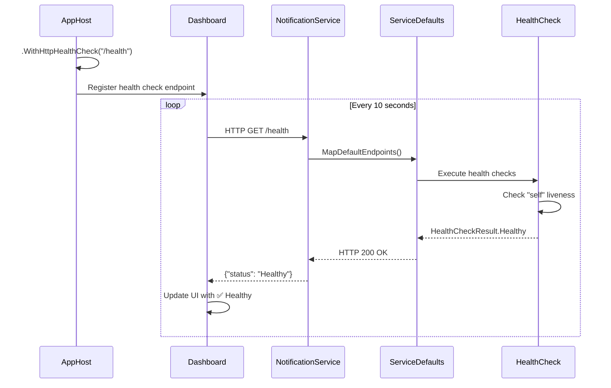

# Aspire ヘルスチェック フロー図

## 実装前後の比較

### 実装前 ❌

```
AppHost
  ↓
┌─────────────────────────────────────────────────────┐
│ Aspire Dashboard - Resources View                  │
├─────────────────────────────────────────────────────┤
│ Name                    State      Health           │
│ employeeservice-api     Running    -                │ ← No health monitoring
│ authservice-api         Running    -                │ ← No health monitoring  
│ notificationservice-api Running    -                │ ← No health monitoring
│ blazorweb               Running    -                │
│ redis                   Running    -                │
└─────────────────────────────────────────────────────┘

問題: サービスが正常に動作しているかダッシュボードから確認できない
```

### 実装後 ✅

```
AppHost (.WithHttpHealthCheck("/health"))
  ↓ (定期ポーリング: /health)
┌─────────────────────────────────────────────────────┐
│ Aspire Dashboard - Resources View                  │
├─────────────────────────────────────────────────────┤
│ Name                    State      Health           │
│ employeeservice-api     Running    ✅ Healthy       │ ← Monitored!
│ authservice-api         Running    ✅ Healthy       │ ← Monitored!
│ notificationservice-api Running    ✅ Healthy       │ ← Monitored! (NEW)
│ blazorweb               Running    -                │
│ redis                   Running    -                │
└─────────────────────────────────────────────────────┘

解決: すべてのマイクロサービスのヘルスステータスがリアルタイムで表示
```

## ヘルスチェックの仕組み



## コード変更の詳細

### AppHost.cs の変更

```csharp
// ━━━━━━━━━━━━━━━━━━━━━━━━━━━━━━━━━━━━━━━━━━━━━━━━━━━━━━
// EmployeeService - 従業員管理サービス
// ━━━━━━━━━━━━━━━━━━━━━━━━━━━━━━━━━━━━━━━━━━━━━━━━━━━━━━
var employeeServiceApi = builder.AddProject<Projects.EmployeeService_API>("employeeservice-api")
    .WithReference(employeeDb)
    .WithReference(redis)
    .WithHttpHealthCheck("/health");  // ← 追加

// ━━━━━━━━━━━━━━━━━━━━━━━━━━━━━━━━━━━━━━━━━━━━━━━━━━━━━━
// AuthService - 認証サービス
// ━━━━━━━━━━━━━━━━━━━━━━━━━━━━━━━━━━━━━━━━━━━━━━━━━━━━━━
var authServiceApi = builder.AddProject<Projects.AuthService_API>("authservice-api")
    .WithReference(authDb)
    .WithHttpHealthCheck("/health");  // ← 追加

// ━━━━━━━━━━━━━━━━━━━━━━━━━━━━━━━━━━━━━━━━━━━━━━━━━━━━━━
// NotificationService - 通知サービス (Issue対象)
// ━━━━━━━━━━━━━━━━━━━━━━━━━━━━━━━━━━━━━━━━━━━━━━━━━━━━━━
var notificationServiceApi = builder.AddProject<Projects.NotificationService_API>("notificationservice-api")
    .WithReference(notificationDb)
    .WithReference(redis)
    .WithHttpHealthCheck("/health");  // ← 追加 (本Issue対象)
```

## ヘルスチェックレスポンス例

### Healthy状態

```json
{
  "status": "Healthy",
  "totalDuration": "00:00:00.0234567",
  "entries": {
    "self": {
      "status": "Healthy",
      "description": "Basic liveness check",
      "duration": "00:00:00.0012345",
      "tags": ["live"]
    }
  }
}
```

### Unhealthy状態 (例: データベース接続失敗)

```json
{
  "status": "Unhealthy",
  "totalDuration": "00:00:05.1234567",
  "entries": {
    "self": {
      "status": "Healthy",
      "description": "Basic liveness check"
    },
    "database": {
      "status": "Unhealthy",
      "description": "Database connection failed",
      "exception": "TimeoutException: Connection timeout",
      "duration": "00:00:05.0000000"
    }
  }
}
```

## 利点

### 🔍 可観測性の向上
- すべてのマイクロサービスの健全性を一目で確認
- 問題のあるサービスを素早く特定

### 🚀 運用効率の向上
- ダッシュボードからリアルタイムで監視
- アラートやログ確認の前に異常を検知

### 🛠️ デバッグの効率化
- サービスが起動しているが応答しない場合を検知
- ヘルスチェック詳細から問題箇所を特定

### 📊 依存関係管理
- `.WaitFor()` と組み合わせて依存サービスの準備を待機
- 起動順序の制御が可能

## 既存機能との互換性

✅ **完全な後方互換性**
- 既存の`/health`エンドポイントをそのまま使用
- ServiceDefaultsの設定は変更なし
- アプリケーションコードの変更不要

✅ **追加の設定のみ**
- AppHost.csでの設定追加のみ
- 各サービスの変更は不要

## まとめ

この実装により：

1. ✅ NotificationServiceのヘルスステータスがダッシュボードに表示される
2. ✅ すべてのマイクロサービスの監視が統一される
3. ✅ システム全体の可観測性が向上する
4. ✅ 問題の早期発見と迅速な対応が可能になる

---

**関連ドキュメント**:
- [Aspireダッシュボード使用ガイド](../../docs/aspire-dashboard.md)
- [.NET Aspire Health Checks](https://learn.microsoft.com/en-us/dotnet/aspire/fundamentals/health-checks)
