# Projects and dependencies analysis

This document provides a comprehensive overview of the projects and their dependencies in the context of upgrading to .NETCoreApp,Version=v10.0.

## Table of Contents

- [Executive Summary](#executive-Summary)
  - [Highlevel Metrics](#highlevel-metrics)
  - [Projects Compatibility](#projects-compatibility)
  - [Package Compatibility](#package-compatibility)
  - [API Compatibility](#api-compatibility)
- [Aggregate NuGet packages details](#aggregate-nuget-packages-details)
- [Top API Migration Challenges](#top-api-migration-challenges)
  - [Technologies and Features](#technologies-and-features)
  - [Most Frequent API Issues](#most-frequent-api-issues)
- [Projects Relationship Graph](#projects-relationship-graph)
- [Project Details](#project-details)

  - [src\AppHost\AppHost.csproj](#srcapphostapphostcsproj)
  - [src\ServiceDefaults\ServiceDefaults.csproj](#srcservicedefaultsservicedefaultscsproj)
  - [src\Services\AttendanceService\API\AttendanceService.API.csproj](#srcservicesattendanceserviceapiattendanceserviceapicsproj)
  - [src\Services\AttendanceService\Application\AttendanceService.Application.csproj](#srcservicesattendanceserviceapplicationattendanceserviceapplicationcsproj)
  - [src\Services\AttendanceService\Domain\AttendanceService.Domain.csproj](#srcservicesattendanceservicedomainattendanceservicedomaincsproj)
  - [src\Services\AttendanceService\Infrastructure\AttendanceService.Infrastructure.csproj](#srcservicesattendanceserviceinfrastructureattendanceserviceinfrastructurecsproj)
  - [src\Services\AuthService\API\AuthService.API.csproj](#srcservicesauthserviceapiauthserviceapicsproj)
  - [src\Services\AuthService\Application\AuthService.Application.csproj](#srcservicesauthserviceapplicationauthserviceapplicationcsproj)
  - [src\Services\AuthService\Domain\AuthService.Domain.csproj](#srcservicesauthservicedomainauthservicedomaincsproj)
  - [src\Services\AuthService\Infrastructure\AuthService.Infrastructure.csproj](#srcservicesauthserviceinfrastructureauthserviceinfrastructurecsproj)
  - [src\Services\EmployeeService\API\EmployeeService.API.csproj](#srcservicesemployeeserviceapiemployeeserviceapicsproj)
  - [src\Services\EmployeeService\Application\EmployeeService.Application.csproj](#srcservicesemployeeserviceapplicationemployeeserviceapplicationcsproj)
  - [src\Services\EmployeeService\Domain\EmployeeService.Domain.csproj](#srcservicesemployeeservicedomainemployeeservicedomaincsproj)
  - [src\Services\EmployeeService\Infrastructure\EmployeeService.Infrastructure.csproj](#srcservicesemployeeserviceinfrastructureemployeeserviceinfrastructurecsproj)
  - [src\Services\NotificationService\API\NotificationService.API.csproj](#srcservicesnotificationserviceapinotificationserviceapicsproj)
  - [src\Services\NotificationService\Application\NotificationService.Application.csproj](#srcservicesnotificationserviceapplicationnotificationserviceapplicationcsproj)
  - [src\Services\NotificationService\Domain\NotificationService.Domain.csproj](#srcservicesnotificationservicedomainnotificationservicedomaincsproj)
  - [src\Services\NotificationService\Infrastructure\NotificationService.Infrastructure.csproj](#srcservicesnotificationserviceinfrastructurenotificationserviceinfrastructurecsproj)
  - [src\Shared\Contracts\Shared.Contracts.csproj](#srcsharedcontractssharedcontractscsproj)
  - [src\WebApps\BlazorWeb\BlazorWeb.csproj](#srcwebappsblazorwebblazorwebcsproj)
  - [tests\AttendanceService.Domain.Tests\AttendanceService.Domain.Tests.csproj](#testsattendanceservicedomaintestsattendanceservicedomaintestscsproj)
  - [tests\AuthService.Tests\AuthService.Tests.csproj](#testsauthservicetestsauthservicetestscsproj)
  - [tests\EmployeeService.Application.Tests\EmployeeService.Application.Tests.csproj](#testsemployeeserviceapplicationtestsemployeeserviceapplicationtestscsproj)
  - [tests\EmployeeService.Domain.Tests\EmployeeService.Domain.Tests.csproj](#testsemployeeservicedomaintestsemployeeservicedomaintestscsproj)
  - [tests\EmployeeService.Integration.Tests\EmployeeService.Integration.Tests.csproj](#testsemployeeserviceintegrationtestsemployeeserviceintegrationtestscsproj)


## Executive Summary

### Highlevel Metrics

| Metric | Count | Status |
| :--- | :---: | :--- |
| Total Projects | 25 | All require upgrade |
| Total NuGet Packages | 0 | All compatible |
| Total Code Files | 135 |  |
| Total Code Files with Incidents | 42 |  |
| Total Lines of Code | 13593 |  |
| Total Number of Issues | 218 |  |
| Estimated LOC to modify | 149+ | at least 1.1% of codebase |

### Projects Compatibility

| Project | Target Framework | Difficulty | Package Issues | API Issues | Est. LOC Impact | Description |
| :--- | :---: | :---: | :---: | :---: | :---: | :--- |
| [src\AppHost\AppHost.csproj](#srcapphostapphostcsproj) | net9.0 | 🟢 Low | 4 | 0 |  | DotNetCoreApp, Sdk Style = True |
| [src\ServiceDefaults\ServiceDefaults.csproj](#srcservicedefaultsservicedefaultscsproj) | net9.0 | 🟢 Low | 4 | 0 |  | ClassLibrary, Sdk Style = True |
| [src\Services\AttendanceService\API\AttendanceService.API.csproj](#srcservicesattendanceserviceapiattendanceserviceapicsproj) | net9.0 | 🟢 Low | 4 | 6 | 6+ | AspNetCore, Sdk Style = True |
| [src\Services\AttendanceService\Application\AttendanceService.Application.csproj](#srcservicesattendanceserviceapplicationattendanceserviceapplicationcsproj) | net9.0 | 🟢 Low | 0 | 0 |  | ClassLibrary, Sdk Style = True |
| [src\Services\AttendanceService\Domain\AttendanceService.Domain.csproj](#srcservicesattendanceservicedomainattendanceservicedomaincsproj) | net9.0 | 🟢 Low | 0 | 0 |  | ClassLibrary, Sdk Style = True |
| [src\Services\AttendanceService\Infrastructure\AttendanceService.Infrastructure.csproj](#srcservicesattendanceserviceinfrastructureattendanceserviceinfrastructurecsproj) | net9.0 | 🟢 Low | 2 | 0 |  | ClassLibrary, Sdk Style = True |
| [src\Services\AuthService\API\AuthService.API.csproj](#srcservicesauthserviceapiauthserviceapicsproj) | net9.0 | 🟢 Low | 4 | 0 |  | AspNetCore, Sdk Style = True |
| [src\Services\AuthService\Application\AuthService.Application.csproj](#srcservicesauthserviceapplicationauthserviceapplicationcsproj) | net9.0 | 🟢 Low | 0 | 0 |  | ClassLibrary, Sdk Style = True |
| [src\Services\AuthService\Domain\AuthService.Domain.csproj](#srcservicesauthservicedomainauthservicedomaincsproj) | net9.0 | 🟢 Low | 1 | 0 |  | ClassLibrary, Sdk Style = True |
| [src\Services\AuthService\Infrastructure\AuthService.Infrastructure.csproj](#srcservicesauthserviceinfrastructureauthserviceinfrastructurecsproj) | net9.0 | 🟢 Low | 3 | 17 | 17+ | ClassLibrary, Sdk Style = True |
| [src\Services\EmployeeService\API\EmployeeService.API.csproj](#srcservicesemployeeserviceapiemployeeserviceapicsproj) | net9.0 | 🟢 Low | 4 | 5 | 5+ | AspNetCore, Sdk Style = True |
| [src\Services\EmployeeService\Application\EmployeeService.Application.csproj](#srcservicesemployeeserviceapplicationemployeeserviceapplicationcsproj) | net9.0 | 🟢 Low | 0 | 0 |  | ClassLibrary, Sdk Style = True |
| [src\Services\EmployeeService\Domain\EmployeeService.Domain.csproj](#srcservicesemployeeservicedomainemployeeservicedomaincsproj) | net9.0 | 🟢 Low | 0 | 0 |  | ClassLibrary, Sdk Style = True |
| [src\Services\EmployeeService\Infrastructure\EmployeeService.Infrastructure.csproj](#srcservicesemployeeserviceinfrastructureemployeeserviceinfrastructurecsproj) | net9.0 | 🟢 Low | 2 | 0 |  | ClassLibrary, Sdk Style = True |
| [src\Services\NotificationService\API\NotificationService.API.csproj](#srcservicesnotificationserviceapinotificationserviceapicsproj) | net9.0 | 🟢 Low | 4 | 0 |  | AspNetCore, Sdk Style = True |
| [src\Services\NotificationService\Application\NotificationService.Application.csproj](#srcservicesnotificationserviceapplicationnotificationserviceapplicationcsproj) | net9.0 | 🟢 Low | 1 | 0 |  | ClassLibrary, Sdk Style = True |
| [src\Services\NotificationService\Domain\NotificationService.Domain.csproj](#srcservicesnotificationservicedomainnotificationservicedomaincsproj) | net9.0 | 🟢 Low | 0 | 0 |  | ClassLibrary, Sdk Style = True |
| [src\Services\NotificationService\Infrastructure\NotificationService.Infrastructure.csproj](#srcservicesnotificationserviceinfrastructurenotificationserviceinfrastructurecsproj) | net9.0 | 🟢 Low | 3 | 0 |  | ClassLibrary, Sdk Style = True |
| [src\Shared\Contracts\Shared.Contracts.csproj](#srcsharedcontractssharedcontractscsproj) | net9.0 | 🟢 Low | 0 | 0 |  | ClassLibrary, Sdk Style = True |
| [src\WebApps\BlazorWeb\BlazorWeb.csproj](#srcwebappsblazorwebblazorwebcsproj) | net9.0 | 🟢 Low | 0 | 53 | 53+ | AspNetCore, Sdk Style = True |
| [tests\AttendanceService.Domain.Tests\AttendanceService.Domain.Tests.csproj](#testsattendanceservicedomaintestsattendanceservicedomaintestscsproj) | net9.0 | 🟢 Low | 0 | 0 |  | DotNetCoreApp, Sdk Style = True |
| [tests\AuthService.Tests\AuthService.Tests.csproj](#testsauthservicetestsauthservicetestscsproj) | net9.0 | 🟢 Low | 5 | 20 | 20+ | DotNetCoreApp, Sdk Style = True |
| [tests\EmployeeService.Application.Tests\EmployeeService.Application.Tests.csproj](#testsemployeeserviceapplicationtestsemployeeserviceapplicationtestscsproj) | net9.0 | 🟢 Low | 0 | 0 |  | DotNetCoreApp, Sdk Style = True |
| [tests\EmployeeService.Domain.Tests\EmployeeService.Domain.Tests.csproj](#testsemployeeservicedomaintestsemployeeservicedomaintestscsproj) | net9.0 | 🟢 Low | 0 | 0 |  | DotNetCoreApp, Sdk Style = True |
| [tests\EmployeeService.Integration.Tests\EmployeeService.Integration.Tests.csproj](#testsemployeeserviceintegrationtestsemployeeserviceintegrationtestscsproj) | net9.0 | 🟢 Low | 3 | 48 | 48+ | DotNetCoreApp, Sdk Style = True |

### Package Compatibility

| Status | Count | Percentage |
| :--- | :---: | :---: |
| ✅ Compatible | 0 | 0.0% |
| ⚠️ Incompatible | 0 | 0.0% |
| 🔄 Upgrade Recommended | 0 | 0.0% |
| ***Total NuGet Packages*** | ***0*** | ***100%*** |

### API Compatibility

| Category | Count | Impact |
| :--- | :---: | :--- |
| 🔴 Binary Incompatible | 44 | High - Require code changes |
| 🟡 Source Incompatible | 12 | Medium - Needs re-compilation and potential conflicting API error fixing |
| 🔵 Behavioral change | 93 | Low - Behavioral changes that may require testing at runtime |
| ✅ Compatible | 28583 |  |
| ***Total APIs Analyzed*** | ***28732*** |  |

## Aggregate NuGet packages details

| Package | Current Version | Suggested Version | Projects | Description |
| :--- | :---: | :---: | :--- | :--- |

## Top API Migration Challenges

### Technologies and Features

| Technology | Issues | Percentage | Migration Path |
| :--- | :---: | :---: | :--- |
| IdentityModel & Claims-based Security | 44 | 29.5% | Windows Identity Foundation (WIF), SAML, and claims-based authentication APIs that have been replaced by modern identity libraries. WIF was the original identity framework for .NET Framework. Migrate to Microsoft.IdentityModel.* packages (modern identity stack). |

### Most Frequent API Issues

| API | Count | Percentage | Category |
| :--- | :---: | :---: | :--- |
| T:System.Net.Http.HttpContent | 72 | 48.3% | Behavioral Change |
| T:System.Uri | 12 | 8.1% | Behavioral Change |
| T:System.IdentityModel.Tokens.Jwt.JwtRegisteredClaimNames | 10 | 6.7% | Binary Incompatible |
| M:System.Uri.#ctor(System.String) | 6 | 4.0% | Behavioral Change |
| T:System.IdentityModel.Tokens.Jwt.JwtSecurityTokenHandler | 4 | 2.7% | Binary Incompatible |
| M:System.IdentityModel.Tokens.Jwt.JwtSecurityTokenHandler.#ctor | 4 | 2.7% | Binary Incompatible |
| F:System.IdentityModel.Tokens.Jwt.JwtRegisteredClaimNames.UniqueName | 3 | 2.0% | Binary Incompatible |
| T:Microsoft.Extensions.DependencyInjection.IdentityEntityFrameworkBuilderExtensions | 3 | 2.0% | Source Incompatible |
| M:Microsoft.Extensions.DependencyInjection.IdentityEntityFrameworkBuilderExtensions.AddEntityFrameworkStores''1(Microsoft.AspNetCore.Identity.IdentityBuilder) | 3 | 2.0% | Source Incompatible |
| P:System.IdentityModel.Tokens.Jwt.JwtSecurityToken.Claims | 3 | 2.0% | Binary Incompatible |
| M:System.IdentityModel.Tokens.Jwt.JwtSecurityTokenHandler.WriteToken(Microsoft.IdentityModel.Tokens.SecurityToken) | 2 | 1.3% | Binary Incompatible |
| T:System.IdentityModel.Tokens.Jwt.JwtSecurityToken | 2 | 1.3% | Binary Incompatible |
| M:System.IdentityModel.Tokens.Jwt.JwtSecurityToken.#ctor(System.String,System.String,System.Collections.Generic.IEnumerable{System.Security.Claims.Claim},System.Nullable{System.DateTime},System.Nullable{System.DateTime},Microsoft.IdentityModel.Tokens.SigningCredentials) | 2 | 1.3% | Binary Incompatible |
| F:System.IdentityModel.Tokens.Jwt.JwtRegisteredClaimNames.Iat | 2 | 1.3% | Binary Incompatible |
| F:System.IdentityModel.Tokens.Jwt.JwtRegisteredClaimNames.Jti | 2 | 1.3% | Binary Incompatible |
| F:System.IdentityModel.Tokens.Jwt.JwtRegisteredClaimNames.Sub | 2 | 1.3% | Binary Incompatible |
| P:System.IdentityModel.Tokens.Jwt.JwtSecurityToken.Audiences | 2 | 1.3% | Binary Incompatible |
| P:System.IdentityModel.Tokens.Jwt.JwtSecurityToken.Issuer | 2 | 1.3% | Binary Incompatible |
| M:System.IdentityModel.Tokens.Jwt.JwtSecurityTokenHandler.ReadToken(System.String) | 2 | 1.3% | Binary Incompatible |
| M:Microsoft.AspNetCore.Builder.ExceptionHandlerExtensions.UseExceptionHandler(Microsoft.AspNetCore.Builder.IApplicationBuilder,System.Action{Microsoft.AspNetCore.Builder.IApplicationBuilder}) | 1 | 0.7% | Behavioral Change |
| M:Microsoft.Extensions.DependencyInjection.HttpClientFactoryServiceCollectionExtensions.AddHttpClient(Microsoft.Extensions.DependencyInjection.IServiceCollection,System.String,System.Action{System.Net.Http.HttpClient}) | 1 | 0.7% | Behavioral Change |
| F:System.IdentityModel.Tokens.Jwt.JwtRegisteredClaimNames.Email | 1 | 0.7% | Binary Incompatible |
| P:System.IdentityModel.Tokens.Jwt.JwtSecurityToken.Subject | 1 | 0.7% | Binary Incompatible |
| M:System.Threading.Tasks.Task.WhenAll(System.ReadOnlySpan{System.Threading.Tasks.Task}) | 1 | 0.7% | Source Incompatible |
| M:Microsoft.AspNetCore.Builder.ExceptionHandlerExtensions.UseExceptionHandler(Microsoft.AspNetCore.Builder.IApplicationBuilder,System.String,System.Boolean) | 1 | 0.7% | Behavioral Change |
| T:Microsoft.AspNetCore.Authentication.JwtBearer.JwtBearerDefaults | 1 | 0.7% | Source Incompatible |
| F:Microsoft.AspNetCore.Authentication.JwtBearer.JwtBearerDefaults.AuthenticationScheme | 1 | 0.7% | Source Incompatible |
| P:Microsoft.AspNetCore.Authentication.JwtBearer.JwtBearerOptions.TokenValidationParameters | 1 | 0.7% | Source Incompatible |
| T:Microsoft.Extensions.DependencyInjection.JwtBearerExtensions | 1 | 0.7% | Source Incompatible |
| M:Microsoft.Extensions.DependencyInjection.JwtBearerExtensions.AddJwtBearer(Microsoft.AspNetCore.Authentication.AuthenticationBuilder,System.Action{Microsoft.AspNetCore.Authentication.JwtBearer.JwtBearerOptions}) | 1 | 0.7% | Source Incompatible |

## Projects Relationship Graph

Legend:
📦 SDK-style project
⚙️ Classic project

```mermaid
flowchart LR
    P1["<b>📦&nbsp;AppHost.csproj</b><br/><small>net9.0</small>"]
    P2["<b>📦&nbsp;ServiceDefaults.csproj</b><br/><small>net9.0</small>"]
    P3["<b>📦&nbsp;AttendanceService.API.csproj</b><br/><small>net9.0</small>"]
    P4["<b>📦&nbsp;AttendanceService.Application.csproj</b><br/><small>net9.0</small>"]
    P5["<b>📦&nbsp;AttendanceService.Domain.csproj</b><br/><small>net9.0</small>"]
    P6["<b>📦&nbsp;AttendanceService.Infrastructure.csproj</b><br/><small>net9.0</small>"]
    P7["<b>📦&nbsp;AuthService.API.csproj</b><br/><small>net9.0</small>"]
    P8["<b>📦&nbsp;AuthService.Application.csproj</b><br/><small>net9.0</small>"]
    P9["<b>📦&nbsp;AuthService.Domain.csproj</b><br/><small>net9.0</small>"]
    P10["<b>📦&nbsp;AuthService.Infrastructure.csproj</b><br/><small>net9.0</small>"]
    P11["<b>📦&nbsp;EmployeeService.API.csproj</b><br/><small>net9.0</small>"]
    P12["<b>📦&nbsp;EmployeeService.Application.csproj</b><br/><small>net9.0</small>"]
    P13["<b>📦&nbsp;EmployeeService.Domain.csproj</b><br/><small>net9.0</small>"]
    P14["<b>📦&nbsp;EmployeeService.Infrastructure.csproj</b><br/><small>net9.0</small>"]
    P15["<b>📦&nbsp;NotificationService.API.csproj</b><br/><small>net9.0</small>"]
    P16["<b>📦&nbsp;NotificationService.Application.csproj</b><br/><small>net9.0</small>"]
    P17["<b>📦&nbsp;NotificationService.Domain.csproj</b><br/><small>net9.0</small>"]
    P18["<b>📦&nbsp;NotificationService.Infrastructure.csproj</b><br/><small>net9.0</small>"]
    P19["<b>📦&nbsp;Shared.Contracts.csproj</b><br/><small>net9.0</small>"]
    P20["<b>📦&nbsp;BlazorWeb.csproj</b><br/><small>net9.0</small>"]
    P21["<b>📦&nbsp;AttendanceService.Domain.Tests.csproj</b><br/><small>net9.0</small>"]
    P22["<b>📦&nbsp;AuthService.Tests.csproj</b><br/><small>net9.0</small>"]
    P23["<b>📦&nbsp;EmployeeService.Application.Tests.csproj</b><br/><small>net9.0</small>"]
    P24["<b>📦&nbsp;EmployeeService.Domain.Tests.csproj</b><br/><small>net9.0</small>"]
    P25["<b>📦&nbsp;EmployeeService.Integration.Tests.csproj</b><br/><small>net9.0</small>"]
    P1 --> P15
    P1 --> P20
    P1 --> P7
    P1 --> P11
    P1 --> P3
    P3 --> P6
    P3 --> P4
    P3 --> P2
    P4 --> P5
    P4 --> P19
    P6 --> P5
    P6 --> P4
    P7 --> P8
    P7 --> P10
    P7 --> P19
    P7 --> P2
    P8 --> P9
    P8 --> P19
    P10 --> P8
    P10 --> P9
    P11 --> P12
    P11 --> P14
    P11 --> P2
    P12 --> P19
    P12 --> P13
    P14 --> P12
    P14 --> P13
    P15 --> P19
    P15 --> P18
    P15 --> P2
    P15 --> P16
    P16 --> P19
    P16 --> P17
    P18 --> P19
    P18 --> P17
    P18 --> P16
    P20 --> P2
    P20 --> P19
    P21 --> P5
    P22 --> P8
    P22 --> P10
    P22 --> P19
    P23 --> P12
    P23 --> P19
    P24 --> P13
    P25 --> P12
    P25 --> P11
    P25 --> P14
    click P1 "#srcapphostapphostcsproj"
    click P2 "#srcservicedefaultsservicedefaultscsproj"
    click P3 "#srcservicesattendanceserviceapiattendanceserviceapicsproj"
    click P4 "#srcservicesattendanceserviceapplicationattendanceserviceapplicationcsproj"
    click P5 "#srcservicesattendanceservicedomainattendanceservicedomaincsproj"
    click P6 "#srcservicesattendanceserviceinfrastructureattendanceserviceinfrastructurecsproj"
    click P7 "#srcservicesauthserviceapiauthserviceapicsproj"
    click P8 "#srcservicesauthserviceapplicationauthserviceapplicationcsproj"
    click P9 "#srcservicesauthservicedomainauthservicedomaincsproj"
    click P10 "#srcservicesauthserviceinfrastructureauthserviceinfrastructurecsproj"
    click P11 "#srcservicesemployeeserviceapiemployeeserviceapicsproj"
    click P12 "#srcservicesemployeeserviceapplicationemployeeserviceapplicationcsproj"
    click P13 "#srcservicesemployeeservicedomainemployeeservicedomaincsproj"
    click P14 "#srcservicesemployeeserviceinfrastructureemployeeserviceinfrastructurecsproj"
    click P15 "#srcservicesnotificationserviceapinotificationserviceapicsproj"
    click P16 "#srcservicesnotificationserviceapplicationnotificationserviceapplicationcsproj"
    click P17 "#srcservicesnotificationservicedomainnotificationservicedomaincsproj"
    click P18 "#srcservicesnotificationserviceinfrastructurenotificationserviceinfrastructurecsproj"
    click P19 "#srcsharedcontractssharedcontractscsproj"
    click P20 "#srcwebappsblazorwebblazorwebcsproj"
    click P21 "#testsattendanceservicedomaintestsattendanceservicedomaintestscsproj"
    click P22 "#testsauthservicetestsauthservicetestscsproj"
    click P23 "#testsemployeeserviceapplicationtestsemployeeserviceapplicationtestscsproj"
    click P24 "#testsemployeeservicedomaintestsemployeeservicedomaintestscsproj"
    click P25 "#testsemployeeserviceintegrationtestsemployeeserviceintegrationtestscsproj"

```

## Project Details

<a id="srcapphostapphostcsproj"></a>
### src\AppHost\AppHost.csproj

#### Project Info

- **Current Target Framework:** net9.0
- **Proposed Target Framework:** net10.0
- **SDK-style**: True
- **Project Kind:** DotNetCoreApp
- **Dependencies**: 5
- **Dependants**: 0
- **Number of Files**: 1
- **Number of Files with Incidents**: 1
- **Lines of Code**: 42
- **Estimated LOC to modify**: 0+ (at least 0.0% of the project)

#### Dependency Graph

Legend:
📦 SDK-style project
⚙️ Classic project

```mermaid
flowchart TB
    subgraph current["AppHost.csproj"]
        MAIN["<b>📦&nbsp;AppHost.csproj</b><br/><small>net9.0</small>"]
        click MAIN "#srcapphostapphostcsproj"
    end
    subgraph downstream["Dependencies (5"]
        P15["<b>📦&nbsp;NotificationService.API.csproj</b><br/><small>net9.0</small>"]
        P20["<b>📦&nbsp;BlazorWeb.csproj</b><br/><small>net9.0</small>"]
        P7["<b>📦&nbsp;AuthService.API.csproj</b><br/><small>net9.0</small>"]
        P11["<b>📦&nbsp;EmployeeService.API.csproj</b><br/><small>net9.0</small>"]
        P3["<b>📦&nbsp;AttendanceService.API.csproj</b><br/><small>net9.0</small>"]
        click P15 "#srcservicesnotificationserviceapinotificationserviceapicsproj"
        click P20 "#srcwebappsblazorwebblazorwebcsproj"
        click P7 "#srcservicesauthserviceapiauthserviceapicsproj"
        click P11 "#srcservicesemployeeserviceapiemployeeserviceapicsproj"
        click P3 "#srcservicesattendanceserviceapiattendanceserviceapicsproj"
    end
    MAIN --> P15
    MAIN --> P20
    MAIN --> P7
    MAIN --> P11
    MAIN --> P3

```

### API Compatibility

| Category | Count | Impact |
| :--- | :---: | :--- |
| 🔴 Binary Incompatible | 0 | High - Require code changes |
| 🟡 Source Incompatible | 0 | Medium - Needs re-compilation and potential conflicting API error fixing |
| 🔵 Behavioral change | 0 | Low - Behavioral changes that may require testing at runtime |
| ✅ Compatible | 115 |  |
| ***Total APIs Analyzed*** | ***115*** |  |

<a id="srcservicedefaultsservicedefaultscsproj"></a>
### src\ServiceDefaults\ServiceDefaults.csproj

#### Project Info

- **Current Target Framework:** net9.0
- **Proposed Target Framework:** net10.0
- **SDK-style**: True
- **Project Kind:** ClassLibrary
- **Dependencies**: 0
- **Dependants**: 5
- **Number of Files**: 1
- **Number of Files with Incidents**: 1
- **Lines of Code**: 127
- **Estimated LOC to modify**: 0+ (at least 0.0% of the project)

#### Dependency Graph

Legend:
📦 SDK-style project
⚙️ Classic project

```mermaid
flowchart TB
    subgraph upstream["Dependants (5)"]
        P3["<b>📦&nbsp;AttendanceService.API.csproj</b><br/><small>net9.0</small>"]
        P7["<b>📦&nbsp;AuthService.API.csproj</b><br/><small>net9.0</small>"]
        P11["<b>📦&nbsp;EmployeeService.API.csproj</b><br/><small>net9.0</small>"]
        P15["<b>📦&nbsp;NotificationService.API.csproj</b><br/><small>net9.0</small>"]
        P20["<b>📦&nbsp;BlazorWeb.csproj</b><br/><small>net9.0</small>"]
        click P3 "#srcservicesattendanceserviceapiattendanceserviceapicsproj"
        click P7 "#srcservicesauthserviceapiauthserviceapicsproj"
        click P11 "#srcservicesemployeeserviceapiemployeeserviceapicsproj"
        click P15 "#srcservicesnotificationserviceapinotificationserviceapicsproj"
        click P20 "#srcwebappsblazorwebblazorwebcsproj"
    end
    subgraph current["ServiceDefaults.csproj"]
        MAIN["<b>📦&nbsp;ServiceDefaults.csproj</b><br/><small>net9.0</small>"]
        click MAIN "#srcservicedefaultsservicedefaultscsproj"
    end
    P3 --> MAIN
    P7 --> MAIN
    P11 --> MAIN
    P15 --> MAIN
    P20 --> MAIN

```

### API Compatibility

| Category | Count | Impact |
| :--- | :---: | :--- |
| 🔴 Binary Incompatible | 0 | High - Require code changes |
| 🟡 Source Incompatible | 0 | Medium - Needs re-compilation and potential conflicting API error fixing |
| 🔵 Behavioral change | 0 | Low - Behavioral changes that may require testing at runtime |
| ✅ Compatible | 122 |  |
| ***Total APIs Analyzed*** | ***122*** |  |

<a id="srcservicesattendanceserviceapiattendanceserviceapicsproj"></a>
### src\Services\AttendanceService\API\AttendanceService.API.csproj

#### Project Info

- **Current Target Framework:** net9.0
- **Proposed Target Framework:** net10.0
- **SDK-style**: True
- **Project Kind:** AspNetCore
- **Dependencies**: 3
- **Dependants**: 1
- **Number of Files**: 3
- **Number of Files with Incidents**: 2
- **Lines of Code**: 1119
- **Estimated LOC to modify**: 6+ (at least 0.5% of the project)

#### Dependency Graph

Legend:
📦 SDK-style project
⚙️ Classic project

```mermaid
flowchart TB
    subgraph upstream["Dependants (1)"]
        P1["<b>📦&nbsp;AppHost.csproj</b><br/><small>net9.0</small>"]
        click P1 "#srcapphostapphostcsproj"
    end
    subgraph current["AttendanceService.API.csproj"]
        MAIN["<b>📦&nbsp;AttendanceService.API.csproj</b><br/><small>net9.0</small>"]
        click MAIN "#srcservicesattendanceserviceapiattendanceserviceapicsproj"
    end
    subgraph downstream["Dependencies (3"]
        P6["<b>📦&nbsp;AttendanceService.Infrastructure.csproj</b><br/><small>net9.0</small>"]
        P4["<b>📦&nbsp;AttendanceService.Application.csproj</b><br/><small>net9.0</small>"]
        P2["<b>📦&nbsp;ServiceDefaults.csproj</b><br/><small>net9.0</small>"]
        click P6 "#srcservicesattendanceserviceinfrastructureattendanceserviceinfrastructurecsproj"
        click P4 "#srcservicesattendanceserviceapplicationattendanceserviceapplicationcsproj"
        click P2 "#srcservicedefaultsservicedefaultscsproj"
    end
    P1 --> MAIN
    MAIN --> P6
    MAIN --> P4
    MAIN --> P2

```

### API Compatibility

| Category | Count | Impact |
| :--- | :---: | :--- |
| 🔴 Binary Incompatible | 0 | High - Require code changes |
| 🟡 Source Incompatible | 0 | Medium - Needs re-compilation and potential conflicting API error fixing |
| 🔵 Behavioral change | 6 | Low - Behavioral changes that may require testing at runtime |
| ✅ Compatible | 1841 |  |
| ***Total APIs Analyzed*** | ***1847*** |  |

<a id="srcservicesattendanceserviceapplicationattendanceserviceapplicationcsproj"></a>
### src\Services\AttendanceService\Application\AttendanceService.Application.csproj

#### Project Info

- **Current Target Framework:** net9.0
- **Proposed Target Framework:** net10.0
- **SDK-style**: True
- **Project Kind:** ClassLibrary
- **Dependencies**: 2
- **Dependants**: 2
- **Number of Files**: 5
- **Number of Files with Incidents**: 1
- **Lines of Code**: 454
- **Estimated LOC to modify**: 0+ (at least 0.0% of the project)

#### Dependency Graph

Legend:
📦 SDK-style project
⚙️ Classic project


### API Compatibility

| Category | Count | Impact |
| :--- | :---: | :--- |
| 🔴 Binary Incompatible | 0 | High - Require code changes |
| 🟡 Source Incompatible | 0 | Medium - Needs re-compilation and potential conflicting API error fixing |
| 🔵 Behavioral change | 0 | Low - Behavioral changes that may require testing at runtime |
| ✅ Compatible | 305 |  |
| ***Total APIs Analyzed*** | ***305*** |  |

<a id="srcservicesattendanceservicedomainattendanceservicedomaincsproj"></a>
### src\Services\AttendanceService\Domain\AttendanceService.Domain.csproj

#### Project Info

- **Current Target Framework:** net9.0
- **Proposed Target Framework:** net10.0
- **SDK-style**: True
- **Project Kind:** ClassLibrary
- **Dependencies**: 0
- **Dependants**: 3
- **Number of Files**: 9
- **Number of Files with Incidents**: 1
- **Lines of Code**: 625
- **Estimated LOC to modify**: 0+ (at least 0.0% of the project)

#### Dependency Graph

Legend:
📦 SDK-style project
⚙️ Classic project


### API Compatibility

| Category | Count | Impact |
| :--- | :---: | :--- |
| 🔴 Binary Incompatible | 0 | High - Require code changes |
| 🟡 Source Incompatible | 0 | Medium - Needs re-compilation and potential conflicting API error fixing |
| 🔵 Behavioral change | 0 | Low - Behavioral changes that may require testing at runtime |
| ✅ Compatible | 483 |  |
| ***Total APIs Analyzed*** | ***483*** |  |

<a id="srcservicesattendanceserviceinfrastructureattendanceserviceinfrastructurecsproj"></a>
### src\Services\AttendanceService\Infrastructure\AttendanceService.Infrastructure.csproj

#### Project Info

- **Current Target Framework:** net9.0
- **Proposed Target Framework:** net10.0
- **SDK-style**: True
- **Project Kind:** ClassLibrary
- **Dependencies**: 2
- **Dependants**: 1
- **Number of Files**: 10
- **Number of Files with Incidents**: 1
- **Lines of Code**: 930
- **Estimated LOC to modify**: 0+ (at least 0.0% of the project)

#### Dependency Graph

Legend:
📦 SDK-style project
⚙️ Classic project

```mermaid
flowchart TB
    subgraph upstream["Dependants (1)"]
        P3["<b>📦&nbsp;AttendanceService.API.csproj</b><br/><small>net9.0</small>"]
        click P3 "#srcservicesattendanceserviceapiattendanceserviceapicsproj"
    end
    subgraph current["AttendanceService.Infrastructure.csproj"]
        MAIN["<b>📦&nbsp;AttendanceService.Infrastructure.csproj</b><br/><small>net9.0</small>"]
        click MAIN "#srcservicesattendanceserviceinfrastructureattendanceserviceinfrastructurecsproj"
    end
    subgraph downstream["Dependencies (2"]
        P5["<b>📦&nbsp;AttendanceService.Domain.csproj</b><br/><small>net9.0</small>"]
        P4["<b>📦&nbsp;AttendanceService.Application.csproj</b><br/><small>net9.0</small>"]
        click P5 "#srcservicesattendanceservicedomainattendanceservicedomaincsproj"
        click P4 "#srcservicesattendanceserviceapplicationattendanceserviceapplicationcsproj"
    end
    P3 --> MAIN
    MAIN --> P5
    MAIN --> P4

```

### API Compatibility

| Category | Count | Impact |
| :--- | :---: | :--- |
| 🔴 Binary Incompatible | 0 | High - Require code changes |
| 🟡 Source Incompatible | 0 | Medium - Needs re-compilation and potential conflicting API error fixing |
| 🔵 Behavioral change | 0 | Low - Behavioral changes that may require testing at runtime |
| ✅ Compatible | 1066 |  |
| ***Total APIs Analyzed*** | ***1066*** |  |

<a id="srcservicesauthserviceapiauthserviceapicsproj"></a>
### src\Services\AuthService\API\AuthService.API.csproj

#### Project Info

- **Current Target Framework:** net9.0
- **Proposed Target Framework:** net10.0
- **SDK-style**: True
- **Project Kind:** AspNetCore
- **Dependencies**: 4
- **Dependants**: 1
- **Number of Files**: 3
- **Number of Files with Incidents**: 1
- **Lines of Code**: 70
- **Estimated LOC to modify**: 0+ (at least 0.0% of the project)

#### Dependency Graph

Legend:
📦 SDK-style project
⚙️ Classic project

```mermaid
flowchart TB
    subgraph upstream["Dependants (1)"]
        P1["<b>📦&nbsp;AppHost.csproj</b><br/><small>net9.0</small>"]
        click P1 "#srcapphostapphostcsproj"
    end
    subgraph current["AuthService.API.csproj"]
        MAIN["<b>📦&nbsp;AuthService.API.csproj</b><br/><small>net9.0</small>"]
        click MAIN "#srcservicesauthserviceapiauthserviceapicsproj"
    end
    subgraph downstream["Dependencies (4"]
        P8["<b>📦&nbsp;AuthService.Application.csproj</b><br/><small>net9.0</small>"]
        P10["<b>📦&nbsp;AuthService.Infrastructure.csproj</b><br/><small>net9.0</small>"]
        P19["<b>📦&nbsp;Shared.Contracts.csproj</b><br/><small>net9.0</small>"]
        P2["<b>📦&nbsp;ServiceDefaults.csproj</b><br/><small>net9.0</small>"]
        click P8 "#srcservicesauthserviceapplicationauthserviceapplicationcsproj"
        click P10 "#srcservicesauthserviceinfrastructureauthserviceinfrastructurecsproj"
        click P19 "#srcsharedcontractssharedcontractscsproj"
        click P2 "#srcservicedefaultsservicedefaultscsproj"
    end
    P1 --> MAIN
    MAIN --> P8
    MAIN --> P10
    MAIN --> P19
    MAIN --> P2

```

### API Compatibility

| Category | Count | Impact |
| :--- | :---: | :--- |
| 🔴 Binary Incompatible | 0 | High - Require code changes |
| 🟡 Source Incompatible | 0 | Medium - Needs re-compilation and potential conflicting API error fixing |
| 🔵 Behavioral change | 0 | Low - Behavioral changes that may require testing at runtime |
| ✅ Compatible | 95 |  |
| ***Total APIs Analyzed*** | ***95*** |  |

<a id="srcservicesauthserviceapplicationauthserviceapplicationcsproj"></a>
### src\Services\AuthService\Application\AuthService.Application.csproj

#### Project Info

- **Current Target Framework:** net9.0
- **Proposed Target Framework:** net10.0
- **SDK-style**: True
- **Project Kind:** ClassLibrary
- **Dependencies**: 2
- **Dependants**: 3
- **Number of Files**: 2
- **Number of Files with Incidents**: 1
- **Lines of Code**: 40
- **Estimated LOC to modify**: 0+ (at least 0.0% of the project)

#### Dependency Graph

Legend:
📦 SDK-style project
⚙️ Classic project

```mermaid
flowchart TB
    subgraph upstream["Dependants (3)"]
        P7["<b>📦&nbsp;AuthService.API.csproj</b><br/><small>net9.0</small>"]
        P10["<b>📦&nbsp;AuthService.Infrastructure.csproj</b><br/><small>net9.0</small>"]
        P22["<b>📦&nbsp;AuthService.Tests.csproj</b><br/><small>net9.0</small>"]
        click P7 "#srcservicesauthserviceapiauthserviceapicsproj"
        click P10 "#srcservicesauthserviceinfrastructureauthserviceinfrastructurecsproj"
        click P22 "#testsauthservicetestsauthservicetestscsproj"
    end
    subgraph current["AuthService.Application.csproj"]
        MAIN["<b>📦&nbsp;AuthService.Application.csproj</b><br/><small>net9.0</small>"]
        click MAIN "#srcservicesauthserviceapplicationauthserviceapplicationcsproj"
    end
    subgraph downstream["Dependencies (2"]
        P9["<b>📦&nbsp;AuthService.Domain.csproj</b><br/><small>net9.0</small>"]
        P19["<b>📦&nbsp;Shared.Contracts.csproj</b><br/><small>net9.0</small>"]
        click P9 "#srcservicesauthservicedomainauthservicedomaincsproj"
        click P19 "#srcsharedcontractssharedcontractscsproj"
    end
    P7 --> MAIN
    P10 --> MAIN
    P22 --> MAIN
    MAIN --> P9
    MAIN --> P19

```

### API Compatibility

| Category | Count | Impact |
| :--- | :---: | :--- |
| 🔴 Binary Incompatible | 0 | High - Require code changes |
| 🟡 Source Incompatible | 0 | Medium - Needs re-compilation and potential conflicting API error fixing |
| 🔵 Behavioral change | 0 | Low - Behavioral changes that may require testing at runtime |
| ✅ Compatible | 4 |  |
| ***Total APIs Analyzed*** | ***4*** |  |

<a id="srcservicesauthservicedomainauthservicedomaincsproj"></a>
### src\Services\AuthService\Domain\AuthService.Domain.csproj

#### Project Info

- **Current Target Framework:** net9.0
- **Proposed Target Framework:** net10.0
- **SDK-style**: True
- **Project Kind:** ClassLibrary
- **Dependencies**: 0
- **Dependants**: 2
- **Number of Files**: 1
- **Number of Files with Incidents**: 1
- **Lines of Code**: 19
- **Estimated LOC to modify**: 0+ (at least 0.0% of the project)

#### Dependency Graph

Legend:
📦 SDK-style project
⚙️ Classic project

```mermaid
flowchart TB
    subgraph upstream["Dependants (2)"]
        P8["<b>📦&nbsp;AuthService.Application.csproj</b><br/><small>net9.0</small>"]
        P10["<b>📦&nbsp;AuthService.Infrastructure.csproj</b><br/><small>net9.0</small>"]
        click P8 "#srcservicesauthserviceapplicationauthserviceapplicationcsproj"
        click P10 "#srcservicesauthserviceinfrastructureauthserviceinfrastructurecsproj"
    end
    subgraph current["AuthService.Domain.csproj"]
        MAIN["<b>📦&nbsp;AuthService.Domain.csproj</b><br/><small>net9.0</small>"]
        click MAIN "#srcservicesauthservicedomainauthservicedomaincsproj"
    end
    P8 --> MAIN
    P10 --> MAIN

```

### API Compatibility

| Category | Count | Impact |
| :--- | :---: | :--- |
| 🔴 Binary Incompatible | 0 | High - Require code changes |
| 🟡 Source Incompatible | 0 | Medium - Needs re-compilation and potential conflicting API error fixing |
| 🔵 Behavioral change | 0 | Low - Behavioral changes that may require testing at runtime |
| ✅ Compatible | 10 |  |
| ***Total APIs Analyzed*** | ***10*** |  |

<a id="srcservicesauthserviceinfrastructureauthserviceinfrastructurecsproj"></a>
### src\Services\AuthService\Infrastructure\AuthService.Infrastructure.csproj

#### Project Info

- **Current Target Framework:** net9.0
- **Proposed Target Framework:** net10.0
- **SDK-style**: True
- **Project Kind:** ClassLibrary
- **Dependencies**: 2
- **Dependants**: 2
- **Number of Files**: 8
- **Number of Files with Incidents**: 3
- **Lines of Code**: 1171
- **Estimated LOC to modify**: 17+ (at least 1.5% of the project)

#### Dependency Graph

Legend:
📦 SDK-style project
⚙️ Classic project

```mermaid
flowchart TB
    subgraph upstream["Dependants (2)"]
        P7["<b>📦&nbsp;AuthService.API.csproj</b><br/><small>net9.0</small>"]
        P22["<b>📦&nbsp;AuthService.Tests.csproj</b><br/><small>net9.0</small>"]
        click P7 "#srcservicesauthserviceapiauthserviceapicsproj"
        click P22 "#testsauthservicetestsauthservicetestscsproj"
    end
    subgraph current["AuthService.Infrastructure.csproj"]
        MAIN["<b>📦&nbsp;AuthService.Infrastructure.csproj</b><br/><small>net9.0</small>"]
        click MAIN "#srcservicesauthserviceinfrastructureauthserviceinfrastructurecsproj"
    end
    subgraph downstream["Dependencies (2"]
        P8["<b>📦&nbsp;AuthService.Application.csproj</b><br/><small>net9.0</small>"]
        P9["<b>📦&nbsp;AuthService.Domain.csproj</b><br/><small>net9.0</small>"]
        click P8 "#srcservicesauthserviceapplicationauthserviceapplicationcsproj"
        click P9 "#srcservicesauthservicedomainauthservicedomaincsproj"
    end
    P7 --> MAIN
    P22 --> MAIN
    MAIN --> P8
    MAIN --> P9

```

### API Compatibility

| Category | Count | Impact |
| :--- | :---: | :--- |
| 🔴 Binary Incompatible | 15 | High - Require code changes |
| 🟡 Source Incompatible | 2 | Medium - Needs re-compilation and potential conflicting API error fixing |
| 🔵 Behavioral change | 0 | Low - Behavioral changes that may require testing at runtime |
| ✅ Compatible | 1551 |  |
| ***Total APIs Analyzed*** | ***1568*** |  |

#### Project Technologies and Features

| Technology | Issues | Percentage | Migration Path |
| :--- | :---: | :---: | :--- |
| IdentityModel & Claims-based Security | 15 | 88.2% | Windows Identity Foundation (WIF), SAML, and claims-based authentication APIs that have been replaced by modern identity libraries. WIF was the original identity framework for .NET Framework. Migrate to Microsoft.IdentityModel.* packages (modern identity stack). |

<a id="srcservicesemployeeserviceapiemployeeserviceapicsproj"></a>
### src\Services\EmployeeService\API\EmployeeService.API.csproj

#### Project Info

- **Current Target Framework:** net9.0
- **Proposed Target Framework:** net10.0
- **SDK-style**: True
- **Project Kind:** AspNetCore
- **Dependencies**: 3
- **Dependants**: 2
- **Number of Files**: 4
- **Number of Files with Incidents**: 2
- **Lines of Code**: 346
- **Estimated LOC to modify**: 5+ (at least 1.4% of the project)

#### Dependency Graph

Legend:
📦 SDK-style project
⚙️ Classic project

```mermaid
flowchart TB
    subgraph upstream["Dependants (2)"]
        P1["<b>📦&nbsp;AppHost.csproj</b><br/><small>net9.0</small>"]
        P25["<b>📦&nbsp;EmployeeService.Integration.Tests.csproj</b><br/><small>net9.0</small>"]
        click P1 "#srcapphostapphostcsproj"
        click P25 "#testsemployeeserviceintegrationtestsemployeeserviceintegrationtestscsproj"
    end
    subgraph current["EmployeeService.API.csproj"]
        MAIN["<b>📦&nbsp;EmployeeService.API.csproj</b><br/><small>net9.0</small>"]
        click MAIN "#srcservicesemployeeserviceapiemployeeserviceapicsproj"
    end
    subgraph downstream["Dependencies (3"]
        P12["<b>📦&nbsp;EmployeeService.Application.csproj</b><br/><small>net9.0</small>"]
        P14["<b>📦&nbsp;EmployeeService.Infrastructure.csproj</b><br/><small>net9.0</small>"]
        P2["<b>📦&nbsp;ServiceDefaults.csproj</b><br/><small>net9.0</small>"]
        click P12 "#srcservicesemployeeserviceapplicationemployeeserviceapplicationcsproj"
        click P14 "#srcservicesemployeeserviceinfrastructureemployeeserviceinfrastructurecsproj"
        click P2 "#srcservicedefaultsservicedefaultscsproj"
    end
    P1 --> MAIN
    P25 --> MAIN
    MAIN --> P12
    MAIN --> P14
    MAIN --> P2

```

### API Compatibility

| Category | Count | Impact |
| :--- | :---: | :--- |
| 🔴 Binary Incompatible | 0 | High - Require code changes |
| 🟡 Source Incompatible | 5 | Medium - Needs re-compilation and potential conflicting API error fixing |
| 🔵 Behavioral change | 0 | Low - Behavioral changes that may require testing at runtime |
| ✅ Compatible | 610 |  |
| ***Total APIs Analyzed*** | ***615*** |  |

<a id="srcservicesemployeeserviceapplicationemployeeserviceapplicationcsproj"></a>
### src\Services\EmployeeService\Application\EmployeeService.Application.csproj

#### Project Info

- **Current Target Framework:** net9.0
- **Proposed Target Framework:** net10.0
- **SDK-style**: True
- **Project Kind:** ClassLibrary
- **Dependencies**: 2
- **Dependants**: 4
- **Number of Files**: 7
- **Number of Files with Incidents**: 1
- **Lines of Code**: 460
- **Estimated LOC to modify**: 0+ (at least 0.0% of the project)

#### Dependency Graph

Legend:
📦 SDK-style project
⚙️ Classic project

```mermaid
flowchart TB
    subgraph upstream["Dependants (4)"]
        P11["<b>📦&nbsp;EmployeeService.API.csproj</b><br/><small>net9.0</small>"]
        P14["<b>📦&nbsp;EmployeeService.Infrastructure.csproj</b><br/><small>net9.0</small>"]
        P23["<b>📦&nbsp;EmployeeService.Application.Tests.csproj</b><br/><small>net9.0</small>"]
        P25["<b>📦&nbsp;EmployeeService.Integration.Tests.csproj</b><br/><small>net9.0</small>"]
        click P11 "#srcservicesemployeeserviceapiemployeeserviceapicsproj"
        click P14 "#srcservicesemployeeserviceinfrastructureemployeeserviceinfrastructurecsproj"
        click P23 "#testsemployeeserviceapplicationtestsemployeeserviceapplicationtestscsproj"
        click P25 "#testsemployeeserviceintegrationtestsemployeeserviceintegrationtestscsproj"
    end
    subgraph current["EmployeeService.Application.csproj"]
        MAIN["<b>📦&nbsp;EmployeeService.Application.csproj</b><br/><small>net9.0</small>"]
        click MAIN "#srcservicesemployeeserviceapplicationemployeeserviceapplicationcsproj"
    end
    subgraph downstream["Dependencies (2"]
        P19["<b>📦&nbsp;Shared.Contracts.csproj</b><br/><small>net9.0</small>"]
        P13["<b>📦&nbsp;EmployeeService.Domain.csproj</b><br/><small>net9.0</small>"]
        click P19 "#srcsharedcontractssharedcontractscsproj"
        click P13 "#srcservicesemployeeservicedomainemployeeservicedomaincsproj"
    end
    P11 --> MAIN
    P14 --> MAIN
    P23 --> MAIN
    P25 --> MAIN
    MAIN --> P19
    MAIN --> P13

```

### API Compatibility

| Category | Count | Impact |
| :--- | :---: | :--- |
| 🔴 Binary Incompatible | 0 | High - Require code changes |
| 🟡 Source Incompatible | 0 | Medium - Needs re-compilation and potential conflicting API error fixing |
| 🔵 Behavioral change | 0 | Low - Behavioral changes that may require testing at runtime |
| ✅ Compatible | 319 |  |
| ***Total APIs Analyzed*** | ***319*** |  |

<a id="srcservicesemployeeservicedomainemployeeservicedomaincsproj"></a>
### src\Services\EmployeeService\Domain\EmployeeService.Domain.csproj

#### Project Info

- **Current Target Framework:** net9.0
- **Proposed Target Framework:** net10.0
- **SDK-style**: True
- **Project Kind:** ClassLibrary
- **Dependencies**: 0
- **Dependants**: 3
- **Number of Files**: 4
- **Number of Files with Incidents**: 1
- **Lines of Code**: 282
- **Estimated LOC to modify**: 0+ (at least 0.0% of the project)

#### Dependency Graph

Legend:
📦 SDK-style project
⚙️ Classic project

```mermaid
flowchart TB
    subgraph upstream["Dependants (3)"]
        P12["<b>📦&nbsp;EmployeeService.Application.csproj</b><br/><small>net9.0</small>"]
        P14["<b>📦&nbsp;EmployeeService.Infrastructure.csproj</b><br/><small>net9.0</small>"]
        P24["<b>📦&nbsp;EmployeeService.Domain.Tests.csproj</b><br/><small>net9.0</small>"]
        click P12 "#srcservicesemployeeserviceapplicationemployeeserviceapplicationcsproj"
        click P14 "#srcservicesemployeeserviceinfrastructureemployeeserviceinfrastructurecsproj"
        click P24 "#testsemployeeservicedomaintestsemployeeservicedomaintestscsproj"
    end
    subgraph current["EmployeeService.Domain.csproj"]
        MAIN["<b>📦&nbsp;EmployeeService.Domain.csproj</b><br/><small>net9.0</small>"]
        click MAIN "#srcservicesemployeeservicedomainemployeeservicedomaincsproj"
    end
    P12 --> MAIN
    P14 --> MAIN
    P24 --> MAIN

```

### API Compatibility

| Category | Count | Impact |
| :--- | :---: | :--- |
| 🔴 Binary Incompatible | 0 | High - Require code changes |
| 🟡 Source Incompatible | 0 | Medium - Needs re-compilation and potential conflicting API error fixing |
| 🔵 Behavioral change | 0 | Low - Behavioral changes that may require testing at runtime |
| ✅ Compatible | 383 |  |
| ***Total APIs Analyzed*** | ***383*** |  |

<a id="srcservicesemployeeserviceinfrastructureemployeeserviceinfrastructurecsproj"></a>
### src\Services\EmployeeService\Infrastructure\EmployeeService.Infrastructure.csproj

#### Project Info

- **Current Target Framework:** net9.0
- **Proposed Target Framework:** net10.0
- **SDK-style**: True
- **Project Kind:** ClassLibrary
- **Dependencies**: 2
- **Dependants**: 2
- **Number of Files**: 14
- **Number of Files with Incidents**: 1
- **Lines of Code**: 1008
- **Estimated LOC to modify**: 0+ (at least 0.0% of the project)

#### Dependency Graph

Legend:
📦 SDK-style project
⚙️ Classic project

```mermaid
flowchart TB
    subgraph upstream["Dependants (2)"]
        P11["<b>📦&nbsp;EmployeeService.API.csproj</b><br/><small>net9.0</small>"]
        P25["<b>📦&nbsp;EmployeeService.Integration.Tests.csproj</b><br/><small>net9.0</small>"]
        click P11 "#srcservicesemployeeserviceapiemployeeserviceapicsproj"
        click P25 "#testsemployeeserviceintegrationtestsemployeeserviceintegrationtestscsproj"
    end
    subgraph current["EmployeeService.Infrastructure.csproj"]
        MAIN["<b>📦&nbsp;EmployeeService.Infrastructure.csproj</b><br/><small>net9.0</small>"]
        click MAIN "#srcservicesemployeeserviceinfrastructureemployeeserviceinfrastructurecsproj"
    end
    subgraph downstream["Dependencies (2"]
        P12["<b>📦&nbsp;EmployeeService.Application.csproj</b><br/><small>net9.0</small>"]
        P13["<b>📦&nbsp;EmployeeService.Domain.csproj</b><br/><small>net9.0</small>"]
        click P12 "#srcservicesemployeeserviceapplicationemployeeserviceapplicationcsproj"
        click P13 "#srcservicesemployeeservicedomainemployeeservicedomaincsproj"
    end
    P11 --> MAIN
    P25 --> MAIN
    MAIN --> P12
    MAIN --> P13

```

### API Compatibility

| Category | Count | Impact |
| :--- | :---: | :--- |
| 🔴 Binary Incompatible | 0 | High - Require code changes |
| 🟡 Source Incompatible | 0 | Medium - Needs re-compilation and potential conflicting API error fixing |
| 🔵 Behavioral change | 0 | Low - Behavioral changes that may require testing at runtime |
| ✅ Compatible | 1072 |  |
| ***Total APIs Analyzed*** | ***1072*** |  |

<a id="srcservicesnotificationserviceapinotificationserviceapicsproj"></a>
### src\Services\NotificationService\API\NotificationService.API.csproj

#### Project Info

- **Current Target Framework:** net9.0
- **Proposed Target Framework:** net10.0
- **SDK-style**: True
- **Project Kind:** AspNetCore
- **Dependencies**: 4
- **Dependants**: 1
- **Number of Files**: 4
- **Number of Files with Incidents**: 1
- **Lines of Code**: 152
- **Estimated LOC to modify**: 0+ (at least 0.0% of the project)

#### Dependency Graph

Legend:
📦 SDK-style project
⚙️ Classic project

```mermaid
flowchart TB
    subgraph upstream["Dependants (1)"]
        P1["<b>📦&nbsp;AppHost.csproj</b><br/><small>net9.0</small>"]
        click P1 "#srcapphostapphostcsproj"
    end
    subgraph current["NotificationService.API.csproj"]
        MAIN["<b>📦&nbsp;NotificationService.API.csproj</b><br/><small>net9.0</small>"]
        click MAIN "#srcservicesnotificationserviceapinotificationserviceapicsproj"
    end
    subgraph downstream["Dependencies (4"]
        P19["<b>📦&nbsp;Shared.Contracts.csproj</b><br/><small>net9.0</small>"]
        P18["<b>📦&nbsp;NotificationService.Infrastructure.csproj</b><br/><small>net9.0</small>"]
        P2["<b>📦&nbsp;ServiceDefaults.csproj</b><br/><small>net9.0</small>"]
        P16["<b>📦&nbsp;NotificationService.Application.csproj</b><br/><small>net9.0</small>"]
        click P19 "#srcsharedcontractssharedcontractscsproj"
        click P18 "#srcservicesnotificationserviceinfrastructurenotificationserviceinfrastructurecsproj"
        click P2 "#srcservicedefaultsservicedefaultscsproj"
        click P16 "#srcservicesnotificationserviceapplicationnotificationserviceapplicationcsproj"
    end
    P1 --> MAIN
    MAIN --> P19
    MAIN --> P18
    MAIN --> P2
    MAIN --> P16

```

### API Compatibility

| Category | Count | Impact |
| :--- | :---: | :--- |
| 🔴 Binary Incompatible | 0 | High - Require code changes |
| 🟡 Source Incompatible | 0 | Medium - Needs re-compilation and potential conflicting API error fixing |
| 🔵 Behavioral change | 0 | Low - Behavioral changes that may require testing at runtime |
| ✅ Compatible | 205 |  |
| ***Total APIs Analyzed*** | ***205*** |  |

<a id="srcservicesnotificationserviceapplicationnotificationserviceapplicationcsproj"></a>
### src\Services\NotificationService\Application\NotificationService.Application.csproj

#### Project Info

- **Current Target Framework:** net9.0
- **Proposed Target Framework:** net10.0
- **SDK-style**: True
- **Project Kind:** ClassLibrary
- **Dependencies**: 2
- **Dependants**: 2
- **Number of Files**: 4
- **Number of Files with Incidents**: 1
- **Lines of Code**: 140
- **Estimated LOC to modify**: 0+ (at least 0.0% of the project)

#### Dependency Graph

Legend:
📦 SDK-style project
⚙️ Classic project

```mermaid
flowchart TB
    subgraph upstream["Dependants (2)"]
        P15["<b>📦&nbsp;NotificationService.API.csproj</b><br/><small>net9.0</small>"]
        P18["<b>📦&nbsp;NotificationService.Infrastructure.csproj</b><br/><small>net9.0</small>"]
        click P15 "#srcservicesnotificationserviceapinotificationserviceapicsproj"
        click P18 "#srcservicesnotificationserviceinfrastructurenotificationserviceinfrastructurecsproj"
    end
    subgraph current["NotificationService.Application.csproj"]
        MAIN["<b>📦&nbsp;NotificationService.Application.csproj</b><br/><small>net9.0</small>"]
        click MAIN "#srcservicesnotificationserviceapplicationnotificationserviceapplicationcsproj"
    end
    subgraph downstream["Dependencies (2"]
        P19["<b>📦&nbsp;Shared.Contracts.csproj</b><br/><small>net9.0</small>"]
        P17["<b>📦&nbsp;NotificationService.Domain.csproj</b><br/><small>net9.0</small>"]
        click P19 "#srcsharedcontractssharedcontractscsproj"
        click P17 "#srcservicesnotificationservicedomainnotificationservicedomaincsproj"
    end
    P15 --> MAIN
    P18 --> MAIN
    MAIN --> P19
    MAIN --> P17

```

### API Compatibility

| Category | Count | Impact |
| :--- | :---: | :--- |
| 🔴 Binary Incompatible | 0 | High - Require code changes |
| 🟡 Source Incompatible | 0 | Medium - Needs re-compilation and potential conflicting API error fixing |
| 🔵 Behavioral change | 0 | Low - Behavioral changes that may require testing at runtime |
| ✅ Compatible | 102 |  |
| ***Total APIs Analyzed*** | ***102*** |  |

<a id="srcservicesnotificationservicedomainnotificationservicedomaincsproj"></a>
### src\Services\NotificationService\Domain\NotificationService.Domain.csproj

#### Project Info

- **Current Target Framework:** net9.0
- **Proposed Target Framework:** net10.0
- **SDK-style**: True
- **Project Kind:** ClassLibrary
- **Dependencies**: 0
- **Dependants**: 2
- **Number of Files**: 2
- **Number of Files with Incidents**: 1
- **Lines of Code**: 193
- **Estimated LOC to modify**: 0+ (at least 0.0% of the project)

#### Dependency Graph

Legend:
📦 SDK-style project
⚙️ Classic project

```mermaid
flowchart TB
    subgraph upstream["Dependants (2)"]
        P16["<b>📦&nbsp;NotificationService.Application.csproj</b><br/><small>net9.0</small>"]
        P18["<b>📦&nbsp;NotificationService.Infrastructure.csproj</b><br/><small>net9.0</small>"]
        click P16 "#srcservicesnotificationserviceapplicationnotificationserviceapplicationcsproj"
        click P18 "#srcservicesnotificationserviceinfrastructurenotificationserviceinfrastructurecsproj"
    end
    subgraph current["NotificationService.Domain.csproj"]
        MAIN["<b>📦&nbsp;NotificationService.Domain.csproj</b><br/><small>net9.0</small>"]
        click MAIN "#srcservicesnotificationservicedomainnotificationservicedomaincsproj"
    end
    P16 --> MAIN
    P18 --> MAIN

```

### API Compatibility

| Category | Count | Impact |
| :--- | :---: | :--- |
| 🔴 Binary Incompatible | 0 | High - Require code changes |
| 🟡 Source Incompatible | 0 | Medium - Needs re-compilation and potential conflicting API error fixing |
| 🔵 Behavioral change | 0 | Low - Behavioral changes that may require testing at runtime |
| ✅ Compatible | 269 |  |
| ***Total APIs Analyzed*** | ***269*** |  |

<a id="srcservicesnotificationserviceinfrastructurenotificationserviceinfrastructurecsproj"></a>
### src\Services\NotificationService\Infrastructure\NotificationService.Infrastructure.csproj

#### Project Info

- **Current Target Framework:** net9.0
- **Proposed Target Framework:** net10.0
- **SDK-style**: True
- **Project Kind:** ClassLibrary
- **Dependencies**: 3
- **Dependants**: 1
- **Number of Files**: 8
- **Number of Files with Incidents**: 1
- **Lines of Code**: 751
- **Estimated LOC to modify**: 0+ (at least 0.0% of the project)

#### Dependency Graph

Legend:
📦 SDK-style project
⚙️ Classic project

```mermaid
flowchart TB
    subgraph upstream["Dependants (1)"]
        P15["<b>📦&nbsp;NotificationService.API.csproj</b><br/><small>net9.0</small>"]
        click P15 "#srcservicesnotificationserviceapinotificationserviceapicsproj"
    end
    subgraph current["NotificationService.Infrastructure.csproj"]
        MAIN["<b>📦&nbsp;NotificationService.Infrastructure.csproj</b><br/><small>net9.0</small>"]
        click MAIN "#srcservicesnotificationserviceinfrastructurenotificationserviceinfrastructurecsproj"
    end
    subgraph downstream["Dependencies (3"]
        P19["<b>📦&nbsp;Shared.Contracts.csproj</b><br/><small>net9.0</small>"]
        P17["<b>📦&nbsp;NotificationService.Domain.csproj</b><br/><small>net9.0</small>"]
        P16["<b>📦&nbsp;NotificationService.Application.csproj</b><br/><small>net9.0</small>"]
        click P19 "#srcsharedcontractssharedcontractscsproj"
        click P17 "#srcservicesnotificationservicedomainnotificationservicedomaincsproj"
        click P16 "#srcservicesnotificationserviceapplicationnotificationserviceapplicationcsproj"
    end
    P15 --> MAIN
    MAIN --> P19
    MAIN --> P17
    MAIN --> P16

```

### API Compatibility

| Category | Count | Impact |
| :--- | :---: | :--- |
| 🔴 Binary Incompatible | 0 | High - Require code changes |
| 🟡 Source Incompatible | 0 | Medium - Needs re-compilation and potential conflicting API error fixing |
| 🔵 Behavioral change | 0 | Low - Behavioral changes that may require testing at runtime |
| ✅ Compatible | 787 |  |
| ***Total APIs Analyzed*** | ***787*** |  |

<a id="srcsharedcontractssharedcontractscsproj"></a>
### src\Shared\Contracts\Shared.Contracts.csproj

#### Project Info

- **Current Target Framework:** net9.0
- **Proposed Target Framework:** net10.0
- **SDK-style**: True
- **Project Kind:** ClassLibrary
- **Dependencies**: 0
- **Dependants**: 10
- **Number of Files**: 25
- **Number of Files with Incidents**: 1
- **Lines of Code**: 732
- **Estimated LOC to modify**: 0+ (at least 0.0% of the project)

#### Dependency Graph

Legend:
📦 SDK-style project
⚙️ Classic project

```mermaid
flowchart TB
    subgraph upstream["Dependants (10)"]
        P4["<b>📦&nbsp;AttendanceService.Application.csproj</b><br/><small>net9.0</small>"]
        P7["<b>📦&nbsp;AuthService.API.csproj</b><br/><small>net9.0</small>"]
        P8["<b>📦&nbsp;AuthService.Application.csproj</b><br/><small>net9.0</small>"]
        P12["<b>📦&nbsp;EmployeeService.Application.csproj</b><br/><small>net9.0</small>"]
        P15["<b>📦&nbsp;NotificationService.API.csproj</b><br/><small>net9.0</small>"]
        P16["<b>📦&nbsp;NotificationService.Application.csproj</b><br/><small>net9.0</small>"]
        P18["<b>📦&nbsp;NotificationService.Infrastructure.csproj</b><br/><small>net9.0</small>"]
        P20["<b>📦&nbsp;BlazorWeb.csproj</b><br/><small>net9.0</small>"]
        P22["<b>📦&nbsp;AuthService.Tests.csproj</b><br/><small>net9.0</small>"]
        P23["<b>📦&nbsp;EmployeeService.Application.Tests.csproj</b><br/><small>net9.0</small>"]
        click P4 "#srcservicesattendanceserviceapplicationattendanceserviceapplicationcsproj"
        click P7 "#srcservicesauthserviceapiauthserviceapicsproj"
        click P8 "#srcservicesauthserviceapplicationauthserviceapplicationcsproj"
        click P12 "#srcservicesemployeeserviceapplicationemployeeserviceapplicationcsproj"
        click P15 "#srcservicesnotificationserviceapinotificationserviceapicsproj"
        click P16 "#srcservicesnotificationserviceapplicationnotificationserviceapplicationcsproj"
        click P18 "#srcservicesnotificationserviceinfrastructurenotificationserviceinfrastructurecsproj"
        click P20 "#srcwebappsblazorwebblazorwebcsproj"
        click P22 "#testsauthservicetestsauthservicetestscsproj"
        click P23 "#testsemployeeserviceapplicationtestsemployeeserviceapplicationtestscsproj"
    end
    subgraph current["Shared.Contracts.csproj"]
        MAIN["<b>📦&nbsp;Shared.Contracts.csproj</b><br/><small>net9.0</small>"]
        click MAIN "#srcsharedcontractssharedcontractscsproj"
    end
    P4 --> MAIN
    P7 --> MAIN
    P8 --> MAIN
    P12 --> MAIN
    P15 --> MAIN
    P16 --> MAIN
    P18 --> MAIN
    P20 --> MAIN
    P22 --> MAIN
    P23 --> MAIN

```

### API Compatibility

| Category | Count | Impact |
| :--- | :---: | :--- |
| 🔴 Binary Incompatible | 0 | High - Require code changes |
| 🟡 Source Incompatible | 0 | Medium - Needs re-compilation and potential conflicting API error fixing |
| 🔵 Behavioral change | 0 | Low - Behavioral changes that may require testing at runtime |
| ✅ Compatible | 1205 |  |
| ***Total APIs Analyzed*** | ***1205*** |  |

<a id="srcwebappsblazorwebblazorwebcsproj"></a>
### src\WebApps\BlazorWeb\BlazorWeb.csproj

#### Project Info

- **Current Target Framework:** net9.0
- **Proposed Target Framework:** net10.0
- **SDK-style**: True
- **Project Kind:** AspNetCore
- **Dependencies**: 2
- **Dependants**: 1
- **Number of Files**: 35
- **Number of Files with Incidents**: 8
- **Lines of Code**: 1488
- **Estimated LOC to modify**: 53+ (at least 3.6% of the project)

#### Dependency Graph

Legend:
📦 SDK-style project
⚙️ Classic project

```mermaid
flowchart TB
    subgraph upstream["Dependants (1)"]
        P1["<b>📦&nbsp;AppHost.csproj</b><br/><small>net9.0</small>"]
        click P1 "#srcapphostapphostcsproj"
    end
    subgraph current["BlazorWeb.csproj"]
        MAIN["<b>📦&nbsp;BlazorWeb.csproj</b><br/><small>net9.0</small>"]
        click MAIN "#srcwebappsblazorwebblazorwebcsproj"
    end
    subgraph downstream["Dependencies (2"]
        P2["<b>📦&nbsp;ServiceDefaults.csproj</b><br/><small>net9.0</small>"]
        P19["<b>📦&nbsp;Shared.Contracts.csproj</b><br/><small>net9.0</small>"]
        click P2 "#srcservicedefaultsservicedefaultscsproj"
        click P19 "#srcsharedcontractssharedcontractscsproj"
    end
    P1 --> MAIN
    MAIN --> P2
    MAIN --> P19

```

### API Compatibility

| Category | Count | Impact |
| :--- | :---: | :--- |
| 🔴 Binary Incompatible | 0 | High - Require code changes |
| 🟡 Source Incompatible | 1 | Medium - Needs re-compilation and potential conflicting API error fixing |
| 🔵 Behavioral change | 52 | Low - Behavioral changes that may require testing at runtime |
| ✅ Compatible | 12918 |  |
| ***Total APIs Analyzed*** | ***12971*** |  |

<a id="testsattendanceservicedomaintestsattendanceservicedomaintestscsproj"></a>
### tests\AttendanceService.Domain.Tests\AttendanceService.Domain.Tests.csproj

#### Project Info

- **Current Target Framework:** net9.0
- **Proposed Target Framework:** net10.0
- **SDK-style**: True
- **Project Kind:** DotNetCoreApp
- **Dependencies**: 1
- **Dependants**: 0
- **Number of Files**: 5
- **Number of Files with Incidents**: 1
- **Lines of Code**: 741
- **Estimated LOC to modify**: 0+ (at least 0.0% of the project)

#### Dependency Graph

Legend:
📦 SDK-style project
⚙️ Classic project

```mermaid
flowchart TB
    subgraph current["AttendanceService.Domain.Tests.csproj"]
        MAIN["<b>📦&nbsp;AttendanceService.Domain.Tests.csproj</b><br/><small>net9.0</small>"]
        click MAIN "#testsattendanceservicedomaintestsattendanceservicedomaintestscsproj"
    end
    subgraph downstream["Dependencies (1"]
        P5["<b>📦&nbsp;AttendanceService.Domain.csproj</b><br/><small>net9.0</small>"]
        click P5 "#srcservicesattendanceservicedomainattendanceservicedomaincsproj"
    end
    MAIN --> P5

```

### API Compatibility

| Category | Count | Impact |
| :--- | :---: | :--- |
| 🔴 Binary Incompatible | 0 | High - Require code changes |
| 🟡 Source Incompatible | 0 | Medium - Needs re-compilation and potential conflicting API error fixing |
| 🔵 Behavioral change | 0 | Low - Behavioral changes that may require testing at runtime |
| ✅ Compatible | 831 |  |
| ***Total APIs Analyzed*** | ***831*** |  |

<a id="testsauthservicetestsauthservicetestscsproj"></a>
### tests\AuthService.Tests\AuthService.Tests.csproj

#### Project Info

- **Current Target Framework:** net9.0
- **Proposed Target Framework:** net10.0
- **SDK-style**: True
- **Project Kind:** DotNetCoreApp
- **Dependencies**: 3
- **Dependants**: 0
- **Number of Files**: 3
- **Number of Files with Incidents**: 2
- **Lines of Code**: 320
- **Estimated LOC to modify**: 20+ (at least 6.3% of the project)

#### Dependency Graph

Legend:
📦 SDK-style project
⚙️ Classic project

```mermaid
flowchart TB
    subgraph current["AuthService.Tests.csproj"]
        MAIN["<b>📦&nbsp;AuthService.Tests.csproj</b><br/><small>net9.0</small>"]
        click MAIN "#testsauthservicetestsauthservicetestscsproj"
    end
    subgraph downstream["Dependencies (3"]
        P8["<b>📦&nbsp;AuthService.Application.csproj</b><br/><small>net9.0</small>"]
        P10["<b>📦&nbsp;AuthService.Infrastructure.csproj</b><br/><small>net9.0</small>"]
        P19["<b>📦&nbsp;Shared.Contracts.csproj</b><br/><small>net9.0</small>"]
        click P8 "#srcservicesauthserviceapplicationauthserviceapplicationcsproj"
        click P10 "#srcservicesauthserviceinfrastructureauthserviceinfrastructurecsproj"
        click P19 "#srcsharedcontractssharedcontractscsproj"
    end
    MAIN --> P8
    MAIN --> P10
    MAIN --> P19

```

### API Compatibility

| Category | Count | Impact |
| :--- | :---: | :--- |
| 🔴 Binary Incompatible | 16 | High - Require code changes |
| 🟡 Source Incompatible | 4 | Medium - Needs re-compilation and potential conflicting API error fixing |
| 🔵 Behavioral change | 0 | Low - Behavioral changes that may require testing at runtime |
| ✅ Compatible | 503 |  |
| ***Total APIs Analyzed*** | ***523*** |  |

#### Project Technologies and Features

| Technology | Issues | Percentage | Migration Path |
| :--- | :---: | :---: | :--- |
| IdentityModel & Claims-based Security | 16 | 80.0% | Windows Identity Foundation (WIF), SAML, and claims-based authentication APIs that have been replaced by modern identity libraries. WIF was the original identity framework for .NET Framework. Migrate to Microsoft.IdentityModel.* packages (modern identity stack). |

<a id="testsemployeeserviceapplicationtestsemployeeserviceapplicationtestscsproj"></a>
### tests\EmployeeService.Application.Tests\EmployeeService.Application.Tests.csproj

#### Project Info

- **Current Target Framework:** net9.0
- **Proposed Target Framework:** net10.0
- **SDK-style**: True
- **Project Kind:** DotNetCoreApp
- **Dependencies**: 2
- **Dependants**: 0
- **Number of Files**: 4
- **Number of Files with Incidents**: 1
- **Lines of Code**: 472
- **Estimated LOC to modify**: 0+ (at least 0.0% of the project)

#### Dependency Graph

Legend:
📦 SDK-style project
⚙️ Classic project

```mermaid
flowchart TB
    subgraph current["EmployeeService.Application.Tests.csproj"]
        MAIN["<b>📦&nbsp;EmployeeService.Application.Tests.csproj</b><br/><small>net9.0</small>"]
        click MAIN "#testsemployeeserviceapplicationtestsemployeeserviceapplicationtestscsproj"
    end
    subgraph downstream["Dependencies (2"]
        P12["<b>📦&nbsp;EmployeeService.Application.csproj</b><br/><small>net9.0</small>"]
        P19["<b>📦&nbsp;Shared.Contracts.csproj</b><br/><small>net9.0</small>"]
        click P12 "#srcservicesemployeeserviceapplicationemployeeserviceapplicationcsproj"
        click P19 "#srcsharedcontractssharedcontractscsproj"
    end
    MAIN --> P12
    MAIN --> P19

```

### API Compatibility

| Category | Count | Impact |
| :--- | :---: | :--- |
| 🔴 Binary Incompatible | 0 | High - Require code changes |
| 🟡 Source Incompatible | 0 | Medium - Needs re-compilation and potential conflicting API error fixing |
| 🔵 Behavioral change | 0 | Low - Behavioral changes that may require testing at runtime |
| ✅ Compatible | 1068 |  |
| ***Total APIs Analyzed*** | ***1068*** |  |

<a id="testsemployeeservicedomaintestsemployeeservicedomaintestscsproj"></a>
### tests\EmployeeService.Domain.Tests\EmployeeService.Domain.Tests.csproj

#### Project Info

- **Current Target Framework:** net9.0
- **Proposed Target Framework:** net10.0
- **SDK-style**: True
- **Project Kind:** DotNetCoreApp
- **Dependencies**: 1
- **Dependants**: 0
- **Number of Files**: 4
- **Number of Files with Incidents**: 1
- **Lines of Code**: 241
- **Estimated LOC to modify**: 0+ (at least 0.0% of the project)

#### Dependency Graph

Legend:
📦 SDK-style project
⚙️ Classic project

```mermaid
flowchart TB
    subgraph current["EmployeeService.Domain.Tests.csproj"]
        MAIN["<b>📦&nbsp;EmployeeService.Domain.Tests.csproj</b><br/><small>net9.0</small>"]
        click MAIN "#testsemployeeservicedomaintestsemployeeservicedomaintestscsproj"
    end
    subgraph downstream["Dependencies (1"]
        P13["<b>📦&nbsp;EmployeeService.Domain.csproj</b><br/><small>net9.0</small>"]
        click P13 "#srcservicesemployeeservicedomainemployeeservicedomaincsproj"
    end
    MAIN --> P13

```

### API Compatibility

| Category | Count | Impact |
| :--- | :---: | :--- |
| 🔴 Binary Incompatible | 0 | High - Require code changes |
| 🟡 Source Incompatible | 0 | Medium - Needs re-compilation and potential conflicting API error fixing |
| 🔵 Behavioral change | 0 | Low - Behavioral changes that may require testing at runtime |
| ✅ Compatible | 272 |  |
| ***Total APIs Analyzed*** | ***272*** |  |

<a id="testsemployeeserviceintegrationtestsemployeeserviceintegrationtestscsproj"></a>
### tests\EmployeeService.Integration.Tests\EmployeeService.Integration.Tests.csproj

#### Project Info

- **Current Target Framework:** net9.0
- **Proposed Target Framework:** net10.0
- **SDK-style**: True
- **Project Kind:** DotNetCoreApp
- **Dependencies**: 3
- **Dependants**: 0
- **Number of Files**: 8
- **Number of Files with Incidents**: 6
- **Lines of Code**: 1670
- **Estimated LOC to modify**: 48+ (at least 2.9% of the project)

#### Dependency Graph

Legend:
📦 SDK-style project
⚙️ Classic project

```mermaid
flowchart TB
    subgraph current["EmployeeService.Integration.Tests.csproj"]
        MAIN["<b>📦&nbsp;EmployeeService.Integration.Tests.csproj</b><br/><small>net9.0</small>"]
        click MAIN "#testsemployeeserviceintegrationtestsemployeeserviceintegrationtestscsproj"
    end
    subgraph downstream["Dependencies (3"]
        P12["<b>📦&nbsp;EmployeeService.Application.csproj</b><br/><small>net9.0</small>"]
        P11["<b>📦&nbsp;EmployeeService.API.csproj</b><br/><small>net9.0</small>"]
        P14["<b>📦&nbsp;EmployeeService.Infrastructure.csproj</b><br/><small>net9.0</small>"]
        click P12 "#srcservicesemployeeserviceapplicationemployeeserviceapplicationcsproj"
        click P11 "#srcservicesemployeeserviceapiemployeeserviceapicsproj"
        click P14 "#srcservicesemployeeserviceinfrastructureemployeeserviceinfrastructurecsproj"
    end
    MAIN --> P12
    MAIN --> P11
    MAIN --> P14

```

### API Compatibility

| Category | Count | Impact |
| :--- | :---: | :--- |
| 🔴 Binary Incompatible | 13 | High - Require code changes |
| 🟡 Source Incompatible | 0 | Medium - Needs re-compilation and potential conflicting API error fixing |
| 🔵 Behavioral change | 35 | Low - Behavioral changes that may require testing at runtime |
| ✅ Compatible | 2447 |  |
| ***Total APIs Analyzed*** | ***2495*** |  |

#### Project Technologies and Features

| Technology | Issues | Percentage | Migration Path |
| :--- | :---: | :---: | :--- |
| IdentityModel & Claims-based Security | 13 | 27.1% | Windows Identity Foundation (WIF), SAML, and claims-based authentication APIs that have been replaced by modern identity libraries. WIF was the original identity framework for .NET Framework. Migrate to Microsoft.IdentityModel.* packages (modern identity stack). |

