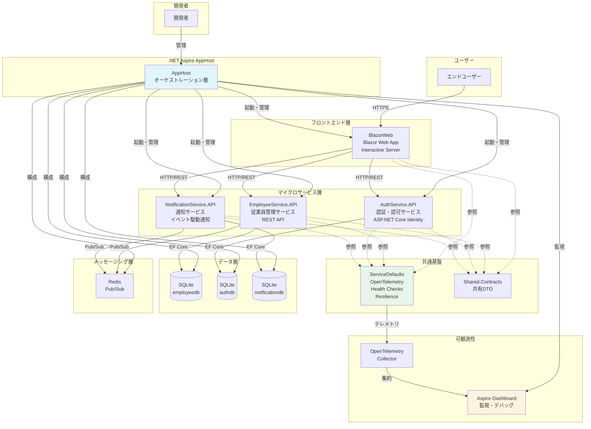
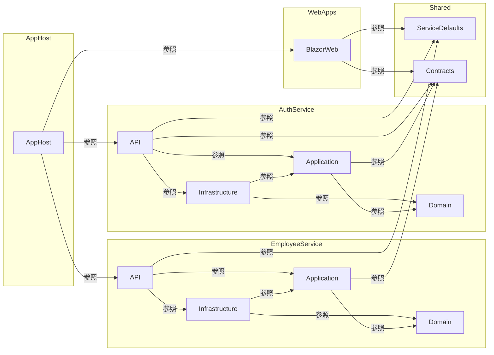
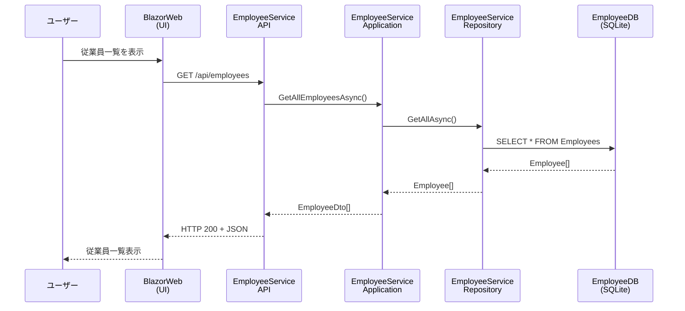
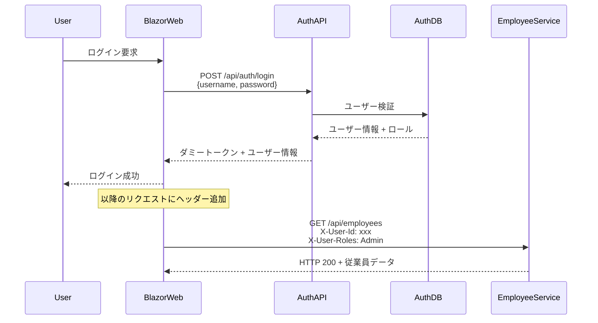

# 従業員管理システム - 詳細アーキテクチャ設計書

## 1. システムアーキテクチャ概要

### 1.1 マイクロサービスアーキテクチャの採用

本システムは、**.NET Aspire** を活用したマイクロサービスアーキテクチャを採用しています。この設計により、以下の利点を実現しています：

**採用理由：**

- **疎結合**: 各サービスが独立して開発・デプロイ可能
- **スケーラビリティ**: 需要に応じて個別のサービスをスケール
- **技術的柔軟性**: サービスごとに最適な技術スタックを選択可能
- **障害分離**: 1つのサービスの障害が全体に波及しない
- **並行開発**: 複数のチームが独立して開発可能

### 1.2 .NET Aspire によるオーケストレーション

.NET Aspire は、分散アプリケーションの開発、実行、監視を簡素化するクラウドネイティブなフレームワークです。

**主要機能：**

- **サービスディスカバリー**: サービス間の自動検出と通信
- **統合オーケストレーション**: すべてのサービスを単一のエントリーポイントから管理
- **OpenTelemetry統合**: 分散トレーシング、メトリクス、ログの統合
- **開発者エクスペリエンス**: Aspireダッシュボードによる可視化と監視
- **リソース管理**: データベースなどの依存リソースの自動構成

### 1.3 システム構成図



## 2. 技術スタック

### 2.1 技術スタック詳細

| カテゴリ | 技術 | バージョン | 選定理由 |
|---------|------|----------|---------|
| **フレームワーク** | .NET | 9.0 | 最新の高性能フレームワーク、C# 13サポート |
| **オーケストレーション** | .NET Aspire | 9.5.2 | マイクロサービス管理、開発体験の向上 |
| **Aspire SDK** | Aspire.AppHost.Sdk | 9.5.2 | アプリケーションホスト構成 |
| **SQLite統合** | CommunityToolkit.Aspire.Hosting.Sqlite | 9.9.0 | Aspireとの統合によるSQLite管理 |
| **フロントエンド** | Blazor Web App | 9.0 | C#による統一的な開発、Interactive Server |
| **UI ライブラリ** | MudBlazor | 8.14.0 | Material Design コンポーネント、高品質UI |
| **ORM** | Entity Framework Core | 9.0.10 | .NET標準のORM、Migrations対応 |
| **データベース** | SQLite | - | 開発環境（軽量、ファイルベース）|
| | Azure SQL | - | 本番環境予定（スケーラビリティ、高可用性）|
| **メッセージング** | Redis | - | Pub/Subメッセージング（イベント駆動通知）|
| **認証** | ASP.NET Core Identity | 9.0.10 | 標準認証機能、ロール管理 |
| **JWT認証** | Microsoft.AspNetCore.Authentication.JwtBearer | 9.0.10 | トークンベース認証（将来実装）|
| **OpenAPI** | Microsoft.AspNetCore.OpenApi | 9.0.10 | API仕様生成、Swagger統合 |
| **可観測性 - OTel** | OpenTelemetry.Exporter.OpenTelemetryProtocol | 1.13.1 | OTLPエクスポーター |
| | OpenTelemetry.Extensions.Hosting | 1.13.1 | .NETホスティング統合 |
| | OpenTelemetry.Instrumentation.AspNetCore | 1.13.0 | ASP.NET Coreインストルメンテーション |
| | OpenTelemetry.Instrumentation.Http | 1.13.0 | HTTPクライアントインストルメンテーション |
| | OpenTelemetry.Instrumentation.Runtime | 1.13.0 | .NETランタイムメトリクス |
| **Resilience** | Microsoft.Extensions.Http.Resilience | 9.10.0 | HTTPリトライ、サーキットブレーカー |
| **サービスディスカバリー** | Microsoft.Extensions.ServiceDiscovery | 9.5.2 | Aspireサービス検出 |
| **テスト** | xUnit | - | .NET標準のテストフレームワーク |
| | Moq | - | モックライブラリ |

### 2.2 アーキテクチャ技術スタック対応表

| 層 | 使用技術 | 目的 |
|----|---------|------|
| **オーケストレーション層** | .NET Aspire AppHost | サービス起動・管理、リソース構成 |
| **プレゼンテーション層** | Blazor Web App, MudBlazor | ユーザーインターフェース |
| **API層** | ASP.NET Core Web API, OpenAPI | RESTful API公開 |
| **アプリケーション層** | C# 13, Record型 | ビジネスロジック、DTO |
| **ドメイン層** | C# 13 Class | エンティティ、ドメインルール |
| **インフラ層** | EF Core, SQLite | データアクセス、外部統合 |
| **横断的関心事** | ServiceDefaults, OpenTelemetry | 可観測性、ヘルスチェック |

## 3. プロジェクト構成

### 3.1 プロジェクト構造

```
DotnetEmployeeManagementSystem/
├── src/
│   ├── AppHost/                              # Aspire オーケストレーション
│   │   ├── AppHost.csproj                    # Aspire.AppHost.Sdk 9.5.2
│   │   └── AppHost.cs                        # サービス構成と起動
│   │
│   ├── ServiceDefaults/                      # 共通設定プロジェクト
│   │   ├── ServiceDefaults.csproj           
│   │   └── Extensions.cs                     # OpenTelemetry, Health Checks拡張
│   │
│   ├── Services/
│   │   ├── EmployeeService/                  # 従業員管理マイクロサービス
│   │   │   ├── Domain/                      # ドメイン層
│   │   │   │   ├── EmployeeService.Domain.csproj
│   │   │   │   ├── Entities/                # エンティティ
│   │   │   │   │   ├── Employee.cs
│   │   │   │   │   └── Department.cs
│   │   │   │   └── Interfaces/              # ドメインインターフェース
│   │   │   │
│   │   │   ├── Application/                 # アプリケーション層
│   │   │   │   ├── EmployeeService.Application.csproj
│   │   │   │   ├── Services/                # アプリケーションサービス
│   │   │   │   ├── DTOs/                    # データ転送オブジェクト
│   │   │   │   └── Interfaces/              # リポジトリインターフェース
│   │   │   │
│   │   │   ├── Infrastructure/              # インフラ層
│   │   │   │   ├── EmployeeService.Infrastructure.csproj
│   │   │   │   ├── Data/                    # EF Core DbContext
│   │   │   │   │   └── EmployeeDbContext.cs
│   │   │   │   ├── Repositories/            # リポジトリ実装
│   │   │   │   └── Migrations/              # EF Core マイグレーション
│   │   │   │
│   │   │   └── API/                         # プレゼンテーション層
│   │   │       ├── EmployeeService.API.csproj
│   │   │       ├── Program.cs               # エントリーポイント
│   │   │       ├── Controllers/             # APIコントローラー
│   │   │       ├── Endpoints/               # Minimal APIエンドポイント
│   │   │       └── appsettings.json
│   │   │
│   │   ├── AuthService/                     # 認証サービス
│   │   │   ├── Domain/                      # ドメイン層
│   │   │   │   └── AuthService.Domain.csproj
│   │   │   ├── Application/                 # アプリケーション層
│   │   │   │   └── AuthService.Application.csproj
│   │   │   ├── Infrastructure/              # インフラ層
│   │   │   │   └── AuthService.Infrastructure.csproj
│   │   │   └── API/                         # プレゼンテーション層
│   │   │       ├── AuthService.API.csproj
│   │   │       └── Program.cs
│   │   │
│   │   └── NotificationService/             # 通知サービス
│   │       ├── Domain/                      # ドメイン層
│   │       │   ├── NotificationService.Domain.csproj
│   │       │   ├── Entities/                # 通知エンティティ
│   │       │   └── Repositories/            # リポジトリインターフェース
│   │       ├── Application/                 # アプリケーション層
│   │       │   ├── NotificationService.Application.csproj
│   │       │   ├── UseCases/                # 通知ユースケース
│   │       │   ├── Services/                # IEmailService
│   │       │   └── Mappings/                # DTOマッピング
│   │       ├── Infrastructure/              # インフラ層
│   │       │   ├── NotificationService.Infrastructure.csproj
│   │       │   ├── Data/                    # DbContext
│   │       │   ├── Repositories/            # リポジトリ実装
│   │       │   ├── Services/                # ConsoleEmailService
│   │       │   ├── Messaging/               # Redis Pub/Sub
│   │       │   └── Workers/                 # バックグラウンド処理
│   │       └── API/                         # プレゼンテーション層
│   │           ├── NotificationService.API.csproj
│   │           ├── Program.cs
│   │           └── Endpoints/               # API エンドポイント
│   │
│   ├── WebApps/
│   │   └── BlazorWeb/                       # Blazor Web UI
│   │       ├── BlazorWeb.csproj
│   │       ├── Program.cs
│   │       ├── Components/                  # Blazor コンポーネント
│   │       │   ├── Pages/                   # ページコンポーネント
│   │       │   ├── Layout/                  # レイアウトコンポーネント
│   │       │   └── Dialogs/                 # ダイアログコンポーネント
│   │       └── Services/                    # UIサービス
│   │
│   └── Shared/
│       └── Contracts/                       # 共有 DTO
│           ├── Shared.Contracts.csproj
│           ├── EmployeeService/             # 従業員サービス契約
│           └── AuthService/                 # 認証サービス契約
│
├── tests/                                    # テストプロジェクト
│   ├── EmployeeService.Domain.Tests/        # ドメイン層テスト
│   ├── EmployeeService.Application.Tests/   # アプリケーション層テスト
│   ├── EmployeeService.Integration.Tests/   # 統合テスト
│   └── AuthService.Tests/                   # 認証サービステスト
│
└── docs/                                     # ドキュメント
    ├── architecture.md                       # アーキテクチャ概要
    ├── architecture-detailed.md              # 本ドキュメント
    ├── development-guide.md                  # 開発ガイド
    ├── aspire-dashboard.md                   # Aspireダッシュボードガイド
    ├── database.md                           # データベース管理
    ├── authorization-implementation.md       # 認可実装
    └── entra-id-integration-design.md        # Entra ID統合設計
```

### 3.2 プロジェクト依存関係



## 4. アーキテクチャパターン

### 4.1 クリーンアーキテクチャ

各マイクロサービスはクリーンアーキテクチャに基づいて設計されています。

#### 層の責務

**Domain 層（ドメイン層）**
- **責務**: ビジネスルールとドメインロジック
- **依存**: なし（他の層に依存しない）
- **内容**:
  - エンティティ（Entity）
  - 値オブジェクト（Value Objects）
  - ドメインイベント
  - ドメインサービス
  - ドメインインターフェース

**バリデーション方式**: コードベース
```csharp
public class Employee
{
    public Guid Id { get; private set; }
    public string Email { get; private set; }
    public DateTime HireDate { get; private set; }
    
    public Employee(string email, DateTime hireDate)
    {
        Email = email ?? throw new ArgumentNullException(nameof(email));
        HireDate = hireDate;
        ValidateEmployee();
    }
    
    private void ValidateEmployee()
    {
        if (!IsValidEmail(Email))
            throw new ArgumentException("有効なメールアドレスを入力してください。");
            
        if (HireDate > DateTime.UtcNow)
            throw new ArgumentException("入社日は現在より前の日付を指定してください。");
    }
}
```

**Application 層（アプリケーション層）**
- **責務**: ユースケースとアプリケーションロジック
- **依存**: Domain層のみ
- **内容**:
  - アプリケーションサービス
  - DTO（Data Transfer Objects）
  - リポジトリインターフェース
  - ユースケースハンドラー

**バリデーション方式**: DataAnnotations
```csharp
public record CreateEmployeeRequest
{
    [Required(ErrorMessage = "名を入力してください。")]
    public string FirstName { get; init; } = string.Empty;
    
    [Required(ErrorMessage = "メールアドレスを入力してください。")]
    [EmailAddress(ErrorMessage = "有効なメールアドレスを入力してください。")]
    public string Email { get; init; } = string.Empty;
}
```

**Infrastructure 層（インフラ層）**
- **責務**: 外部システムとの統合
- **依存**: Domain層、Application層
- **内容**:
  - Entity Framework Core DbContext
  - リポジトリ実装
  - 外部APIクライアント
  - ファイルシステムアクセス
  - データベースマイグレーション

**API 層（プレゼンテーション層）**
- **責務**: HTTPエンドポイントの公開
- **依存**: Application層、Infrastructure層
- **内容**:
  - コントローラー/Minimal API
  - リクエスト/レスポンスモデル
  - 認証/認可
  - OpenAPI/Swagger設定

#### 依存関係の方向

```
API層 ────→ Infrastructure層 ────→ Application層 ────→ Domain層
                                         ↓
                                    Contracts
```

**依存性逆転の原則（DIP）**:
- 上位層（Application）がインターフェースを定義
- 下位層（Infrastructure）がインターフェースを実装
- これにより、ドメイン層はインフラの詳細から独立

### 4.2 マイクロサービス設計

#### サービス分割戦略

**EmployeeService（従業員管理サービス）**
- **責務**: 従業員データの CRUD 操作
- **機能**:
  - 従業員の登録、更新、削除
  - 従業員検索
  - 部門管理
- **データベース**: employeedb (SQLite)
- **エンドポイント**: `/api/employees`, `/api/departments`

**AuthService（認証・認可サービス）**
- **責務**: ユーザー認証とアクセス制御
- **機能**:
  - ユーザー登録、ログイン、ログアウト
  - ロール管理（Admin, User）
  - トークン発行（将来: JWT）
- **データベース**: authdb (SQLite)
- **エンドポイント**: `/api/auth/register`, `/api/auth/login`

**NotificationService（通知サービス）**
- **責務**: イベント駆動型通知管理
- **機能**:
  - 従業員イベント（作成・更新・削除）の自動監視
  - メール通知の自動送信
  - 手動通知送信のサポート
  - 通知履歴の管理と追跡
  - バックグラウンドワーカーによる非同期処理
- **データベース**: notificationdb (SQLite)
- **エンドポイント**: `/api/notifications`
- **メッセージング**: Redis Pub/Sub経由でEmployeeServiceからイベントを受信

詳細は [通知サービス実装ガイド](notification-service.md) を参照してください。

**BlazorWeb（UI フロントエンド）**
- **責務**: ユーザーインターフェース
- **機能**:
  - 従業員一覧表示
  - 従業員登録・編集ダイアログ
  - 通知管理画面
  - ログイン画面
  - 認可によるUI制御
- **通信**: HTTP REST API経由でバックエンドサービスと通信

#### データベース分離

各サービスは独立したデータベースを持ちます：

| サービス | データベース | 管理対象 |
|---------|------------|---------|
| EmployeeService | employeedb | 従業員、部門 |
| AuthService | authdb | ユーザー、ロール |
| NotificationService | notificationdb | 通知、通知履歴 |

**利点**:
- サービスの独立性
- スキーマ変更の影響範囲限定
- 個別のスケーリング
- データの論理的分離

#### メッセージング基盤

**Redis Pub/Sub**を使用したイベント駆動アーキテクチャ：

**役割**:
- サービス間の非同期通信
- イベントの発行と購読
- 疎結合なサービス統合

**イベントチャネル**:
- `employee.created`: 従業員作成イベント
- `employee.updated`: 従業員更新イベント
- `employee.deleted`: 従業員削除イベント

**実装**:
```csharp
// EmployeeService - イベント発行
await _eventPublisher.PublishAsync("employee.created", eventData);

// NotificationService - イベント購読
await subscriber.SubscribeAsync(
    RedisChannel.Literal("employee.created"),
    async (channel, message) => await HandleEventAsync(message));
```

**利点**:
- リアルタイムイベント処理
- サービス間の依存関係削減
- スケーラブルな非同期処理
- 複数のサブスクライバーをサポート

詳細は [通知サービス実装ガイド](notification-service.md) を参照してください。

## 5. データフロー

### 5.1 データフロー図



### 5.2 典型的なリクエストフロー

#### 読み取り操作（従業員取得）

```
1. ユーザー操作
   ↓
2. BlazorWeb (UI)
   ↓ HTTP GET /api/employees
3. EmployeeService.API (コントローラー/エンドポイント)
   ↓ EmployeeService.GetAllAsync()
4. Application層（EmployeeService）
   ↓ Repository.GetAllAsync()
5. Infrastructure層（EmployeeRepository）
   ↓ DbContext.Employees.ToListAsync()
6. EF Core
   ↓ SQL: SELECT * FROM Employees
7. SQLite データベース
   ↓ Employee[] データ
6. EF Core
   ↓ Employee[] エンティティ
5. Infrastructure層
   ↓ Employee[] 返却
4. Application層
   ↓ EmployeeDto[] 変換
3. API層
   ↓ HTTP 200 + JSON
2. BlazorWeb
   ↓ UI更新
1. ユーザーに表示
```

#### 書き込み操作（従業員作成）

```
1. ユーザー操作（管理者のみ）
   ↓
2. BlazorWeb (UI)
   ↓ 認証ヘッダー付き HTTP POST /api/employees
3. EmployeeService.API
   ↓ 認可チェック（[Authorize(Roles = "Admin")]）
   ↓ バリデーション（DataAnnotations）
   ↓ EmployeeService.CreateAsync()
4. Application層
   ↓ Employee エンティティ作成
   ↓ ドメインバリデーション
   ↓ Repository.AddAsync()
5. Infrastructure層
   ↓ DbContext.Employees.Add()
   ↓ DbContext.SaveChangesAsync()
6. EF Core
   ↓ SQL: INSERT INTO Employees
7. SQLite データベース
   ↓ 成功
6. EF Core
5. Infrastructure層
4. Application層
   ↓ EmployeeDto 返却
3. API層
   ↓ HTTP 201 Created + JSON
2. BlazorWeb
   ↓ UI更新（一覧に追加）
1. ユーザーに通知
```

### 5.3 認証フロー



## 6. サービス間通信

### 6.1 通信プロトコル

**HTTP/REST API**
- **プロトコル**: HTTPS（開発環境ではHTTP可）
- **形式**: JSON
- **認証**: カスタムヘッダー（現在）、JWT（将来）

**Aspire サービスディスカバリー**
```csharp
// AppHost.cs - サービス登録
var employeeServiceApi = builder.AddProject<Projects.EmployeeService_API>("employeeservice-api");

builder.AddProject<Projects.BlazorWeb>("blazorweb")
    .WithReference(employeeServiceApi); // サービス参照
```

```csharp
// BlazorWeb - サービス利用
builder.Services.AddHttpClient<EmployeeApiClient>(client =>
{
    // Aspireがサービスディスカバリーを通じて
    // employeeservice-api のURLを自動解決
    client.BaseAddress = new Uri("https+http://employeeservice-api");
});
```

### 6.2 OpenTelemetry による分散トレーシング

すべてのHTTPリクエストは自動的にトレースされます：

```csharp
// ServiceDefaults が自動的に構成
builder.Services.AddOpenTelemetry()
    .WithTracing(tracing =>
    {
        tracing.AddAspNetCoreInstrumentation(); // 受信リクエスト
        tracing.AddHttpClientInstrumentation(); // 送信リクエスト
    });
```

**トレース情報**:
- トレースID: リクエスト全体を追跡
- スパンID: 各操作を追跡
- 親スパン: 呼び出し関係を記録
- タグ: HTTPメソッド、URL、ステータスコードなど

### 6.3 レジリエンスパターン

**Microsoft.Extensions.Http.Resilience** による自動リトライ:

```csharp
builder.Services.AddHttpClient<EmployeeApiClient>()
    .AddStandardResilienceHandler(); // 自動的に以下を追加:
    // - リトライ（指数バックオフ）
    // - サーキットブレーカー
    // - タイムアウト
```

## 7. 可観測性とモニタリング

### 7.1 OpenTelemetry 統合可観測性

ServiceDefaults により、すべてのサービスで統一された可観測性を提供します。

**3つの柱**:

1. **トレース（Traces）**: 分散トレーシング
2. **メトリクス（Metrics）**: パフォーマンス指標
3. **ログ（Logs）**: 構造化ログ

### 7.2 分散トレーシング

**自動トレース対象**:
- ASP.NET Core リクエスト/レスポンス
- HttpClient リクエスト
- データベースクエリ（EF Core）
- .NET ランタイム操作

**トレース例**:
```
TraceId: 4bf92f3577b34da6a3ce929d0e0e4736
├─ BlazorWeb → EmployeeService [200ms]
│  ├─ GET /api/employees [180ms]
│  │  ├─ EmployeeService.GetAllAsync [150ms]
│  │  │  └─ EF Core Query [100ms]
│  │  └─ JSON Serialization [10ms]
│  └─ Response [20ms]
└─ Total Duration: 200ms
```

### 7.3 メトリクス

**標準メトリクス**:
- `http.server.request.duration`: HTTPリクエスト時間
- `http.server.active_requests`: アクティブリクエスト数
- `process.runtime.dotnet.gc.collections.count`: GC回数
- `process.runtime.dotnet.gc.heap.size`: ヒープサイズ

**カスタムメトリクス実装例**:
```csharp
public class EmployeeService
{
    private static readonly Counter<long> _employeeCreated = 
        Meter.CreateCounter<long>("employees.created", "count");
    
    public async Task CreateEmployeeAsync(Employee employee)
    {
        // ... 従業員作成処理
        _employeeCreated.Add(1, new("department", employee.Department));
    }
}
```

### 7.4 構造化ログ

**ILogger による構造化ログ**:
```csharp
public class EmployeeService
{
    private readonly ILogger<EmployeeService> _logger;
    
    public async Task<Employee?> GetEmployeeAsync(Guid id)
    {
        _logger.LogInformation(
            "Retrieving employee {EmployeeId}", 
            id);
        
        try
        {
            var employee = await _repository.GetByIdAsync(id);
            
            if (employee == null)
            {
                _logger.LogWarning(
                    "Employee {EmployeeId} not found", 
                    id);
            }
            
            return employee;
        }
        catch (Exception ex)
        {
            _logger.LogError(ex, 
                "Error retrieving employee {EmployeeId}", 
                id);
            throw;
        }
    }
}
```

### 7.5 Aspire Dashboard によるリアルタイム監視

**アクセス方法**:
```bash
dotnet run --project src/AppHost
# ブラウザで https://localhost:15001 が自動的に開く
```

**主要機能**:
- **リソース**: すべてのサービスの状態とエンドポイント
- **コンソールログ**: リアルタイムログストリーム
- **構造化ログ**: 検索可能なログエントリ
- **トレース**: 分散トレーシングの可視化
- **メトリクス**: パフォーマンスグラフ

## 8. ヘルスチェック

### 8.1 サービスレベルヘルスチェック

すべてのサービスは ServiceDefaults により自動的にヘルスチェックエンドポイントを公開します：

**エンドポイント**:
- `/health`: 詳細なヘルスチェック結果（開発環境のみ）
- `/alive`: 簡易生存確認（常に公開）

**実装**:
```csharp
// ServiceDefaults/Extensions.cs
public static IHostApplicationBuilder AddServiceDefaults(
    this IHostApplicationBuilder builder)
{
    builder.Services.AddHealthChecks()
        .AddCheck("self", () => HealthCheckResult.Healthy());
    
    // 追加のヘルスチェック（例: データベース）
    builder.Services.AddHealthChecks()
        .AddDbContextCheck<EmployeeDbContext>();
}
```

### 8.2 ヘルスチェックレスポンス例

```json
{
  "status": "Healthy",
  "totalDuration": "00:00:00.0123456",
  "entries": {
    "self": {
      "status": "Healthy",
      "duration": "00:00:00.0001234"
    },
    "EmployeeDbContext": {
      "status": "Healthy",
      "duration": "00:00:00.0050000",
      "data": {}
    }
  }
}
```

### 8.3 依存サービスチェック

将来的には以下のヘルスチェックを追加予定：
- データベース接続
- 外部API接続
- メッセージキュー接続
- キャッシュ接続

## 9. セキュリティアーキテクチャ

### 9.1 現在の認証実装

**ASP.NET Core Identity**
- ユーザー管理: SQLite ベース
- パスワードハッシュ: PBKDF2
- ロール管理: Admin, User

**カスタム認証ハンドラー**
```csharp
// EmployeeService.API
public class CustomAuthenticationHandler : AuthenticationHandler<AuthenticationSchemeOptions>
{
    protected override async Task<AuthenticateResult> HandleAuthenticateAsync()
    {
        var userId = Request.Headers["X-User-Id"].ToString();
        var userName = Request.Headers["X-User-Name"].ToString();
        var roles = Request.Headers["X-User-Roles"].ToString();
        
        if (string.IsNullOrEmpty(userId))
            return AuthenticateResult.NoResult();
        
        // クレーム作成とプリンシパル返却
        // ...
    }
}
```

**ダミートークン**（開発環境専用）:
```csharp
private static string GenerateDummyToken(ApplicationUser user)
{
    var tokenData = $"{user.Id}:{user.UserName}:{DateTime.UtcNow:O}";
    return Convert.ToBase64String(Encoding.UTF8.GetBytes(tokenData));
}
```

### 9.2 認可実装

**ロールベースアクセス制御（RBAC）**

```csharp
// EmployeeService.API - 管理者のみアクセス可能
[Authorize(Roles = "Admin")]
[HttpPost]
public async Task<IActionResult> CreateEmployee(CreateEmployeeRequest request)
{
    // ...
}

[Authorize(Roles = "Admin")]
[HttpPut("{id}")]
public async Task<IActionResult> UpdateEmployee(Guid id, UpdateEmployeeRequest request)
{
    // ...
}
```

**UIレベルの認可**:
```razor
@if (AuthStateService.IsAdmin)
{
    <MudButton OnClick="OpenCreateDialog">従業員を追加</MudButton>
}
```

### 9.3 デフォルトユーザー

開発環境で自動作成されるテストユーザー：

| ユーザー名 | パスワード | ロール | 用途 |
|----------|----------|--------|------|
| admin | Admin123! | Admin | 管理者機能テスト |
| testuser | Password123! | User | 一般ユーザーテスト |

### 9.4 今後の実装予定

**JWT トークン認証**
```csharp
builder.Services.AddAuthentication(JwtBearerDefaults.AuthenticationScheme)
    .AddJwtBearer(options =>
    {
        options.TokenValidationParameters = new TokenValidationParameters
        {
            ValidateIssuer = true,
            ValidateAudience = true,
            ValidateLifetime = true,
            ValidateIssuerSigningKey = true,
            ValidIssuer = configuration["Jwt:Issuer"],
            ValidAudience = configuration["Jwt:Audience"],
            IssuerSigningKey = new SymmetricSecurityKey(
                Encoding.UTF8.GetBytes(configuration["Jwt:Key"]))
        };
    });
```

**Microsoft Entra ID 統合**
- OAuth 2.0 / OpenID Connect
- シングルサインオン（SSO）
- 多要素認証（MFA）
- 条件付きアクセス

詳細は [Entra ID統合設計](entra-id-integration-design.md) を参照。

## 10. データベース設計

### 10.1 開発環境: SQLite

**選定理由**:
- インストール不要
- ファイルベース（`employeedb.db`, `authdb.db`）
- 軽量で高速
- バージョン管理から除外可能

**Aspire統合**:
```csharp
// AppHost.cs
var employeeDb = builder.AddSqlite("employeedb");
var employeeServiceApi = builder.AddProject<Projects.EmployeeService_API>("employeeservice-api")
    .WithReference(employeeDb);
```

**接続文字列自動生成**:
Aspireが一時ディレクトリにSQLiteファイルを作成し、接続文字列を自動注入します。

### 10.2 本番環境: Azure SQL Database（予定）

**移行戦略**:

```csharp
// appsettings.Production.json
{
  "ConnectionStrings": {
    "DefaultConnection": "" // Azure Key Vaultから取得
  }
}

// Program.cs
var connectionString = builder.Configuration.GetConnectionString("DefaultConnection")
    ?? Environment.GetEnvironmentVariable("DATABASE_CONNECTION_STRING")
    ?? throw new InvalidOperationException("Connection string not found");

builder.Services.AddDbContext<EmployeeDbContext>(options =>
{
    if (builder.Environment.IsDevelopment())
    {
        options.UseSqlite(connectionString);
    }
    else
    {
        options.UseSqlServer(connectionString);
    }
});
```

### 10.3 EF Core Migrations

**マイグレーション作成**:
```bash
cd src/Services/EmployeeService/Infrastructure
dotnet ef migrations add InitialCreate --startup-project ../API
dotnet ef database update --startup-project ../API
```

**自動マイグレーション適用**（開発環境）:
```csharp
// EmployeeService.API/Program.cs
if (app.Environment.IsDevelopment())
{
    using var scope = app.Services.CreateScope();
    var dbContext = scope.ServiceProvider.GetRequiredService<EmployeeDbContext>();
    await dbContext.Database.MigrateAsync();
}
```

### 10.4 エンティティ設計例

**Employee エンティティ**:
```csharp
public class Employee
{
    public Guid Id { get; private set; }
    public string FirstName { get; private set; }
    public string LastName { get; private set; }
    public string Email { get; private set; }
    public DateTime HireDate { get; private set; }
    public int? DepartmentId { get; private set; }
    
    // ナビゲーションプロパティ
    public Department? Department { get; private set; }
    
    // コンストラクタとメソッド
    // ...
}
```

**EF Core設定**:
```csharp
protected override void OnModelCreating(ModelBuilder modelBuilder)
{
    modelBuilder.Entity<Employee>(entity =>
    {
        entity.HasKey(e => e.Id);
        entity.Property(e => e.FirstName).IsRequired().HasMaxLength(100);
        entity.Property(e => e.LastName).IsRequired().HasMaxLength(100);
        entity.Property(e => e.Email).IsRequired().HasMaxLength(255);
        
        // インデックス
        entity.HasIndex(e => e.Email).IsUnique();
        
        // リレーション
        entity.HasOne(e => e.Department)
              .WithMany(d => d.Employees)
              .HasForeignKey(e => e.DepartmentId)
              .OnDelete(DeleteBehavior.SetNull);
    });
}
```

## 11. デプロイメント戦略

### 11.1 .NET Aspire による統合デプロイメント

**ローカル開発**:
```bash
dotnet run --project src/AppHost
```

Aspire AppHostが以下を自動的に実行：
1. SQLiteデータベースの準備
2. すべてのサービスの起動
3. サービスディスカバリーの構成
4. Aspireダッシュボードの起動
5. OpenTelemetryの構成

### 11.2 コンテナ化（予定）

**Dockerfile例（EmployeeService.API）**:
```dockerfile
FROM mcr.microsoft.com/dotnet/aspnet:9.0 AS base
WORKDIR /app
EXPOSE 8080
EXPOSE 8081

FROM mcr.microsoft.com/dotnet/sdk:9.0 AS build
WORKDIR /src
COPY ["src/Services/EmployeeService/API/EmployeeService.API.csproj", "API/"]
COPY ["src/Services/EmployeeService/Application/EmployeeService.Application.csproj", "Application/"]
COPY ["src/Services/EmployeeService/Domain/EmployeeService.Domain.csproj", "Domain/"]
COPY ["src/Services/EmployeeService/Infrastructure/EmployeeService.Infrastructure.csproj", "Infrastructure/"]
RUN dotnet restore "API/EmployeeService.API.csproj"
COPY . .
WORKDIR "/src/API"
RUN dotnet build "EmployeeService.API.csproj" -c Release -o /app/build

FROM build AS publish
RUN dotnet publish "EmployeeService.API.csproj" -c Release -o /app/publish

FROM base AS final
WORKDIR /app
COPY --from=publish /app/publish .
ENTRYPOINT ["dotnet", "EmployeeService.API.dll"]
```

### 11.3 Azure へのデプロイ（予定）

**.NET Aspire Deployment**:
```bash
# Azure Container Apps へのデプロイ
azd init
azd up
```

**必要なAzureリソース**:
- Azure Container Apps
- Azure SQL Database
- Azure Key Vault（シークレット管理）
- Azure Monitor（可観測性）
- Azure Application Insights（APM）

**Aspire Manifest生成**:
```bash
dotnet run --project src/AppHost -- --output-path ./aspire-manifest.json
```

### 11.4 CI/CD パイプライン（予定）

**GitHub Actions ワークフロー例**:
```yaml
name: Deploy to Azure

on:
  push:
    branches: [ main ]

jobs:
  build-and-deploy:
    runs-on: ubuntu-latest
    steps:
      - uses: actions/checkout@v3
      
      - name: Setup .NET
        uses: actions/setup-dotnet@v3
        with:
          dotnet-version: '9.0.x'
      
      - name: Restore dependencies
        run: dotnet restore
      
      - name: Build
        run: dotnet build --no-restore
      
      - name: Test
        run: dotnet test --no-build --verbosity normal
      
      - name: Deploy to Azure
        run: azd deploy
        env:
          AZURE_CREDENTIALS: ${{ secrets.AZURE_CREDENTIALS }}
```

## 12. スケーラビリティとパフォーマンス

### 12.1 マイクロサービスによる水平スケーリング

各サービスは独立してスケール可能：

```yaml
# Azure Container Apps スケーリング設定例
scale:
  minReplicas: 1
  maxReplicas: 10
  rules:
    - name: http-scaling
      http:
        metadata:
          concurrentRequests: "100"
```

**スケーリング戦略**:
- EmployeeService: リクエスト数に応じて自動スケール
- AuthService: ログイン頻度に応じてスケール
- BlazorWeb: 同時接続数に応じてスケール

### 12.2 データベース接続プーリング

**EF Core 接続プーリング**:
```csharp
builder.Services.AddDbContext<EmployeeDbContext>(options =>
{
    options.UseSqlServer(connectionString, sqlOptions =>
    {
        sqlOptions.EnableRetryOnFailure(
            maxRetryCount: 5,
            maxRetryDelay: TimeSpan.FromSeconds(30),
            errorNumbersToAdd: null);
    });
});
```

### 12.3 非同期処理の活用

**async/await パターン**:
```csharp
public async Task<IEnumerable<Employee>> GetAllEmployeesAsync()
{
    return await _dbContext.Employees
        .AsNoTracking()
        .ToListAsync();
}
```

### 12.4 クエリ最適化

**AsNoTracking による読み取り専用クエリ最適化**:
```csharp
var employees = await _context.Employees
    .AsNoTracking()
    .Include(e => e.Department)
    .ToListAsync();
```

**Select による必要フィールドのみ取得**:
```csharp
var employeeNames = await _context.Employees
    .Select(e => new { e.FirstName, e.LastName })
    .ToListAsync();
```

### 12.5 将来のパフォーマンス改善

**Redisキャッシング**:
```csharp
// 頻繁にアクセスされるデータをキャッシュ
services.AddStackExchangeRedisCache(options =>
{
    options.Configuration = configuration["Redis:ConnectionString"];
});
```

**SignalR リアルタイム更新**:
```csharp
// 従業員データの変更をリアルタイムでUIに通知
await _hubContext.Clients.All.SendAsync("EmployeeUpdated", employee);
```

## 13. 今後の技術的な拡張予定

### 13.1 認証・認可の強化

**優先度: 高**

1. **JWT トークン認証**
   - ステートレス認証
   - トークンリフレッシュ
   - トークン失効管理

2. **Microsoft Entra ID 統合**
   - OAuth 2.0 / OpenID Connect
   - シングルサインオン（SSO）
   - 多要素認証（MFA）
   - 条件付きアクセス

3. **API キー認証**
   - サービス間認証
   - レート制限
   - API使用量追跡

### 13.2 データ管理

**優先度: 高**

1. **Redis キャッシング**
   - 頻繁にアクセスされるデータのキャッシュ
   - セッション管理
   - 分散ロック

2. **Azure SQL Database 移行**
   - 高可用性
   - 自動バックアップ
   - スケーラビリティ

### 13.3 メッセージング

**優先度: 中**

1. **Azure Service Bus / RabbitMQ**
   - 非同期メッセージング
   - イベント駆動アーキテクチャ
   - マイクロサービス間の疎結合

2. **SignalR**
   - リアルタイム通知
   - ライブアップデート
   - チャット機能

### 13.4 API管理

**優先度: 中**

1. **API Gateway**
   - Azure API Management / YARP
   - レート制限
   - APIバージョニング
   - リクエストルーティング

2. **GraphQL**
   - 柔軟なデータ取得
   - クライアント主導のクエリ
   - Hot Chocolate統合

### 13.5 可観測性の強化

**優先度: 低**

1. **Application Insights**
   - 詳細なAPM
   - パフォーマンスプロファイリング
   - ユーザー行動分析

2. **アラートと通知**
   - しきい値ベースアラート
   - Slack/Teams通知
   - オンコール管理

### 13.6 インフラストラクチャ

**優先度: 低**

1. **コンテナ化**
   - Docker化
   - Kubernetes デプロイ
   - Helm チャート

2. **Infrastructure as Code**
   - Terraform / Bicep
   - 環境の自動プロビジョニング
   - 設定のバージョン管理

## 14. 参考ドキュメント

### 内部ドキュメント
- [アーキテクチャ概要](architecture.md) - 高レベルアーキテクチャ
- [開発ガイド](development-guide.md) - 開発手順とベストプラクティス
- [Aspireダッシュボード](aspire-dashboard.md) - 監視とデバッグ
- [データベース管理](database.md) - マイグレーションとクエリ最適化
- [通知サービス実装ガイド](notification-service.md) - イベント駆動通知システム
- [認可実装](authorization-implementation.md) - ロールベースアクセス制御
- [Entra ID統合設計](entra-id-integration-design.md) - エンタープライズ認証統合

### 外部リソース
- [.NET 10 ドキュメント](https://learn.microsoft.com/dotnet/core/whats-new/dotnet-10)
- [.NET Aspire ドキュメント](https://learn.microsoft.com/dotnet/aspire/)
- [Entity Framework Core](https://learn.microsoft.com/ef/core/)
- [OpenTelemetry .NET](https://opentelemetry.io/docs/languages/net/)
- [MudBlazor](https://mudblazor.com/)
- [ASP.NET Core Identity](https://learn.microsoft.com/aspnet/core/security/authentication/identity)

## 15. まとめ

本従業員管理システムは、最新の.NET 10と.NET Aspireを活用した、モダンなマイクロサービスアーキテクチャを採用しています。

**アーキテクチャの特徴**:
- ✅ マイクロサービスアーキテクチャによる疎結合と独立性
- ✅ クリーンアーキテクチャによる保守性と拡張性
- ✅ .NET Aspireによる統合オーケストレーションと可観測性
- ✅ OpenTelemetryによる完全な分散トレーシング
- ✅ ASP.NET Core Identityによる認証・認可
- ✅ Entity Framework Coreによる型安全なデータアクセス
- ✅ Blazor Web AppによるモダンなUI

**現在の実装状況**:
- ✅ 基本的なマイクロサービス構成
- ✅ CRUD操作の実装
- ✅ ロールベースアクセス制御
- ✅ 完全な可観測性（トレース、メトリクス、ログ）
- ✅ ヘルスチェック
- ✅ SQLiteによる開発環境データベース

**今後の拡張**:
- 🔄 JWT トークン認証
- 🔄 Microsoft Entra ID 統合
- 🔄 Redis キャッシング
- 🔄 Azure SQL Database 移行
- 🔄 SignalR リアルタイム通信
- 🔄 コンテナ化とKubernetes デプロイ

このアーキテクチャは、エンタープライズレベルのアプリケーションへの成長を見据えた設計となっており、段階的な機能拡張が可能です。

---

**ドキュメントバージョン**: 1.1  
**最終更新日**: 2025-11-15  
**対象システムバージョン**: .NET 10.0, Aspire 13.0.0
