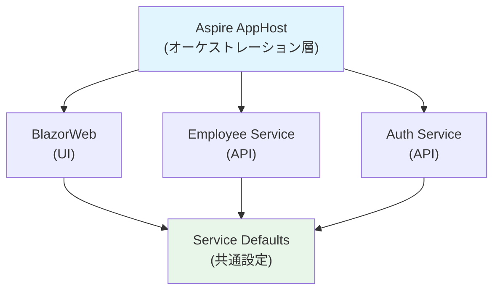
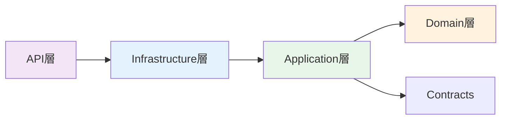
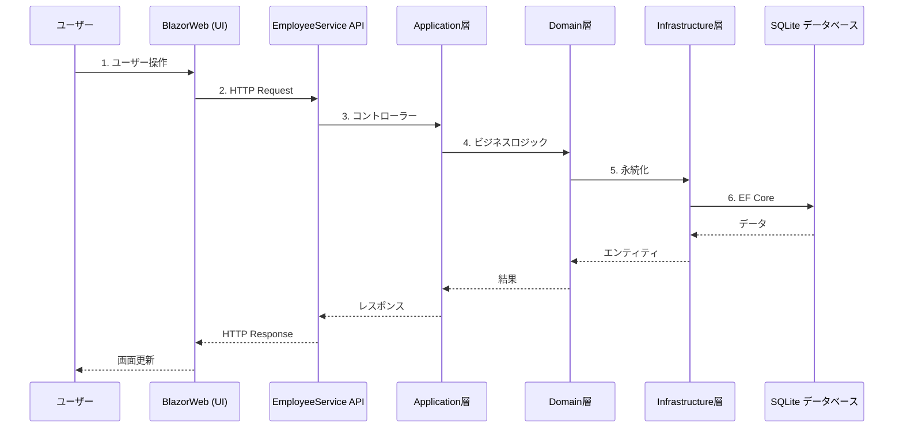

# アーキテクチャ概要

従業員管理システムのアーキテクチャと設計原則について説明します。

## 全体アーキテクチャ

このシステムは**.NET Aspire**を使用したマイクロサービスアーキテクチャで構成されています。



## コンポーネント構成

### 1. Aspire AppHost (`src/AppHost`)

**役割**: すべてのサービスとアプリケーションのオーケストレーション

- サービスの起動と停止の管理
- サービスディスカバリーの提供
- 環境変数と構成の注入
- OpenTelemetryによる分散トレーシング

**主要機能**:
```csharp
// サービスの登録と相互参照
var employeeServiceApi = builder.AddProject<Projects.EmployeeService_API>("employeeservice-api");
var authServiceApi = builder.AddProject<Projects.AuthService_API>("authservice-api");

builder.AddProject<Projects.BlazorWeb>("blazorweb")
    .WithExternalHttpEndpoints()
    .WithReference(employeeServiceApi)
    .WithReference(authServiceApi);
```

### 2. ServiceDefaults (`src/ServiceDefaults`)

**役割**: すべてのサービスで共有される横断的関心事の実装

**提供機能**:
- **OpenTelemetry**: 分散トレーシング、メトリクス、ログ
- **ヘルスチェック**: `/health` および `/alive` エンドポイント
- **サービスディスカバリー**: Aspire経由での他サービスの検出
- **Resilience**: HTTP通信のリトライ、サーキットブレーカー

**使用方法**:
```csharp
// Program.cs
var builder = WebApplication.CreateBuilder(args);
builder.AddServiceDefaults(); // OpenTelemetry、ヘルスチェック等を追加

var app = builder.Build();
app.MapDefaultEndpoints(); // /health, /alive エンドポイントを公開
```

### 3. EmployeeService

**役割**: 従業員データの管理

**クリーンアーキテクチャ**による層構成:

#### Domain層 (`Domain/`)
- **責務**: ビジネスロジックとドメインルール
- **依存**: なし（他の層に依存しない）
- **内容**:
  - エンティティ（Entity）
  - 値オブジェクト（Value Objects）
  - ドメインイベント
  - ドメインサービス

#### Application層 (`Application/`)
- **責務**: ユースケースとアプリケーションロジック
- **依存**: Domain層のみ
- **内容**:
  - コマンド/クエリハンドラー（CQRS）
  - DTO（Data Transfer Objects）
  - リポジトリインターフェース
  - アプリケーションサービス

#### Infrastructure層 (`Infrastructure/`)
- **責務**: 外部システムとの統合
- **依存**: Domain層、Application層
- **内容**:
  - Entity Framework Core DbContext
  - リポジトリ実装
  - 外部APIクライアント
  - ファイルシステムアクセス

#### API層 (`API/`)
- **責務**: HTTPエンドポイントの公開
- **依存**: Application層、Infrastructure層
- **内容**:
  - コントローラー/Minimal API
  - リクエスト/レスポンスモデル
  - 認証/認可
  - OpenAPI/Swagger設定

**依存関係の方向**:


### 4. AuthService (`src/Services/AuthService/API`)

**役割**: ユーザー認証と認可

**主要機能**:
- ASP.NET Core Identityによるユーザー管理
- JWT トークンベース認証（将来実装予定）
- ロールベースアクセス制御
- パスワードポリシーの適用

**将来の拡張**:
- Microsoft Entra ID（旧Azure AD）統合
- OAuth 2.0 / OpenID Connect対応
- 多要素認証（MFA）

### 5. BlazorWeb (`src/WebApps/BlazorWeb`)

**役割**: Webフロントエンド

**技術スタック**:
- Blazor Web App（.NET 9）
- MudBlazor UIコンポーネントライブラリ
- Interactive Server レンダリング

**機能**:
- 従業員情報の表示と編集
- ダッシュボード
- レスポンシブデザイン

### 6. Shared.Contracts (`src/Shared/Contracts`)

**役割**: サービス間で共有されるDTO

**内容**:
- API契約（リクエスト/レスポンスDTO）
- 共有エンティティモデル
- 定数とEnum

## 設計原則とコーディング規約

### バリデーション戦略

このプロジェクトでは、**層ごとに適切なバリデーション手法**を使い分けています。

#### 1. Domain層（エンティティ）

**方針**: コードベースのバリデーション

**理由**:
- **ドメイン駆動設計（DDD）の原則**: エンティティはドメインロジックをカプセル化し、ビジネスルールを保護します
- **不変条件（Invariants）の保証**: コンストラクタとメソッドでの検証により、エンティティが常に有効な状態であることを保証します
- **複雑なビジネスルールへの対応**: カスタムロジック（例: メール検証、日付の範囲チェック）を柔軟に実装できます
- **依存関係の排除**: DataAnnotationsはインフラストラクチャ層の関心事であり、ドメイン層に持ち込むべきではありません
- **EF Coreとの互換性**: DataAnnotationsの一部（例: `[MaxLength]`）はマッピング設定と混同される可能性があります

**実装例**:
```csharp
// src/Services/EmployeeService/Domain/Entities/Employee.cs
public class Employee
{
    public Guid Id { get; private set; }
    public string Email { get; private set; }
    
    public Employee(string email, ...)
    {
        Email = email ?? throw new ArgumentNullException(nameof(email));
        ValidateEmployee();
    }
    
    private void ValidateEmployee()
    {
        if (!IsValidEmail(Email))
            throw new ArgumentException("有効なメールアドレスを入力してください。");
            
        if (HireDate > DateTime.UtcNow)
            throw new ArgumentException("入社日は現在より前の日付を指定してください。");
    }
    
    private static bool IsValidEmail(string email)
    {
        // カスタムメール検証ロジック
    }
}
```

#### 2. Application層（DTO/Contracts）

**方針**: DataAnnotationsを使用

**理由**:
- **API層との統合**: ASP.NET CoreのModelStateと自動的に連携し、バリデーションエラーを返せます
- **シンプルな入力検証**: 基本的なフォーマットチェック（必須項目、メール形式など）に最適です
- **宣言的な記述**: 属性ベースで読みやすく、保守しやすいコードになります
- **自動ドキュメント生成**: Swaggerなどと統合し、API仕様書に検証ルールが自動反映されます

**実装例**:
```csharp
// src/Shared/Contracts/EmployeeService/CreateEmployeeRequest.cs
public record CreateEmployeeRequest
{
    [Required(ErrorMessage = "名を入力してください。")]
    public string FirstName { get; init; } = string.Empty;
    
    [Required(ErrorMessage = "メールアドレスを入力してください。")]
    [EmailAddress(ErrorMessage = "有効なメールアドレスを入力してください。")]
    public string Email { get; init; } = string.Empty;
}
```

#### 3. バリデーションの責務分離

| 層 | バリデーション手法 | 検証内容 |
|---|---|---|
| **Domain** | コードベース | ビジネスルール、不変条件、複雑なロジック |
| **Application/Contracts** | DataAnnotations | 入力形式、必須チェック、基本的な制約 |
| **Infrastructure** | データベース制約 | 一意性、外部キー整合性、NOT NULL |

### コンストラクタ規約

**方針**: プライマリコンストラクターを優先的に使用

**適用対象**:
- サービスクラス（Application層）
- リポジトリ実装（Infrastructure層）
- コントローラー/ハンドラー（API層）

**実装例**:
```csharp
// ✅ 推奨: プライマリコンストラクター
public class EmployeeService(IEmployeeRepository repository) : IEmployeeService
{
    private readonly IEmployeeRepository _repository = repository ?? 
        throw new ArgumentNullException(nameof(repository));
}
```

**例外**:
- エンティティクラス: ビジネスロジックと検証を含むため、従来のコンストラクターを使用
- 複雑な初期化ロジックが必要な場合

### Record型の使用

**方針**: DTOとContractsにはrecord型を使用

**理由**:
- **不変性**: DTOは通常、データの転送のみを目的とし、変更されるべきではありません
- **簡潔な構文**: プロパティの宣言が簡潔になります
- **値の等価性**: 構造的な等価性が自動的に実装されます
- **with式**: 部分的な変更が簡単にできます

**実装例**:
```csharp
// ✅ 推奨: record型
public record EmployeeDto
{
    public Guid Id { get; init; }
    public string FirstName { get; init; } = string.Empty;
}
```

**エンティティには使用しない理由**:
- エンティティは可変状態を持つ（`Update`メソッドなど）
- ビジネスロジックと振る舞いを含む
- EF Coreのためのパラメータなしコンストラクタが必要
- recordは不変データに適しており、ドメインエンティティには不適切

## データフロー

### 典型的なリクエストフロー



## セキュリティ

### 現在の実装
- HTTPS通信
- ServiceDefaults経由でのヘルスチェック認証

### 今後の実装予定
- JWT認証
- APIキー認証
- ロールベースアクセス制御（RBAC）
- 監査ログ

## 可観測性（Observability）

Aspire ServiceDefaultsにより、すべてのサービスで以下が自動的に有効化されます：

### 1. 分散トレーシング
- OpenTelemetryによる分散トレース
- サービス間のリクエストフローの可視化

### 2. メトリクス
- HTTPリクエスト数
- レスポンス時間
- エラー率
- カスタムメトリクス

### 3. ログ
- 構造化ログ
- 相関ID
- ログレベルの動的変更

### 4. ヘルスチェック
- `/health`: 詳細なヘルスチェック結果
- `/alive`: 単純な生存確認

## データベース戦略

### 開発環境
- **SQLite**: ローカル開発用
- ファイル配置: `data/` ディレクトリ

### 本番環境（将来）
- **Azure SQL Database** または **PostgreSQL**
- マイグレーション戦略の策定

## スケーラビリティ

### 水平スケーリング
各マイクロサービスは独立してスケール可能：
- コンテナ化（Docker）
- Kubernetes対応
- Aspire Deploymentによる自動デプロイ

### データベース分離
将来的には各サービスが独自のデータベースを持つ予定：
- EmployeeService → Employee DB
- AuthService → Auth DB

## 関連ドキュメント

- [開発ガイド](development-guide.md)
- [Aspireダッシュボード](aspire-dashboard.md)
- [データベース管理](database.md)
