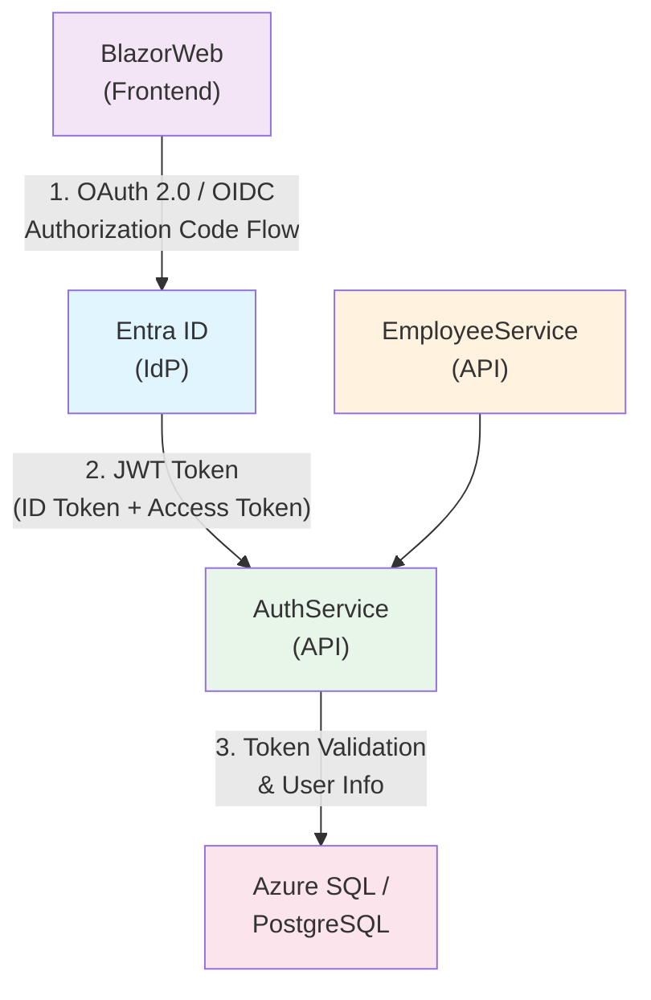

# Microsoft Entra ID 統合設計ドキュメント

## 概要

本ドキュメントでは、従業員管理システムにおけるMicrosoft Entra ID（旧Azure AD）の統合方針と設計について説明します。現在はダミー認証を使用していますが、エンタープライズ環境への移行を想定した設計を提供します。

## 現在の実装状況

### ダミー認証の特徴

現在の実装は以下の方式を採用しています：

- **認証方式**: ASP.NET Core Identity + SQLite
- **トークン**: Base64エンコードされたダミートークン
- **セキュリティ**: ローカル開発環境専用（本番環境非対応）
- **ユーザー管理**: 自己管理型（ユーザー登録・ログイン）

```csharp
// 現在のダミートークン生成
private static string GenerateDummyToken(ApplicationUser user)
{
    var tokenData = $"{user.Id}:{user.UserName}:{DateTime.UtcNow:O}";
    var tokenBytes = System.Text.Encoding.UTF8.GetBytes(tokenData);
    return Convert.ToBase64String(tokenBytes);
}
```

## Entra ID 統合アーキテクチャ

### アーキテクチャ概要



### 認証フロー

1. **ユーザーログイン要求**
   - ユーザーがBlazorWebでログインボタンをクリック
   - Entra IDログインページにリダイレクト

2. **認証と承認**
   - ユーザーがEntra IDで認証（MFA対応可能）
   - 承認後、Authorization Codeを返却

3. **トークン取得**
   - BlazorWebがAuthorization CodeをID Token & Access Tokenに交換
   - トークンを安全に保存（HttpOnly Cookie推奨）

4. **API呼び出し**
   - BlazorWebからAPIへのリクエストにAccess Tokenを付与
   - API側でトークンを検証

5. **トークン更新**
   - Refresh Tokenを使用してトークンを更新
   - シームレスなユーザー体験を提供

## 実装計画

### Phase 1: 基盤準備（1-2週間）

#### 1.1 Azure環境セットアップ

**必要なリソース**:
- Azure サブスクリプション
- Microsoft Entra ID テナント
- App Registration（BlazorWeb用）
- App Registration（AuthService用）

**App Registration設定例（BlazorWeb）**:
```json
{
  "displayName": "EmployeeManagementSystem-BlazorWeb",
  "signInAudience": "AzureADMyOrg",
  "web": {
    "redirectUris": [
      "https://localhost:5001/signin-oidc",
      "https://your-domain.com/signin-oidc"
    ],
    "logoutUrl": "https://localhost:5001/signout-oidc"
  },
  "requiredResourceAccess": [
    {
      "resourceAppId": "00000003-0000-0000-c000-000000000000",
      "resourceAccess": [
        {
          "id": "e1fe6dd8-ba31-4d61-89e7-88639da4683d",
          "type": "Scope"
        }
      ]
    }
  ]
}
```

#### 1.2 NuGetパッケージの追加

**BlazorWeb**:
```xml
<PackageReference Include="Microsoft.Identity.Web" Version="2.15.0" />
<PackageReference Include="Microsoft.Identity.Web.UI" Version="2.15.0" />
```

**AuthService.API**:
```xml
<PackageReference Include="Microsoft.Identity.Web" Version="2.15.0" />
<PackageReference Include="Microsoft.AspNetCore.Authentication.JwtBearer" Version="9.0.0" />
```

### Phase 2: BlazorWeb認証実装（1週間）

#### 2.1 Program.cs設定

```csharp
using Microsoft.Identity.Web;
using Microsoft.Identity.Web.UI;

var builder = WebApplication.CreateBuilder(args);

// Add Microsoft Identity Web authentication
builder.Services.AddMicrosoftIdentityWebAppAuthentication(
    builder.Configuration.GetSection("AzureAd"));

// Add authorization
builder.Services.AddAuthorization(options =>
{
    options.FallbackPolicy = options.DefaultPolicy;
});

builder.Services.AddRazorPages()
    .AddMicrosoftIdentityUI();

// ... existing service registrations

var app = builder.Build();

app.UseAuthentication();
app.UseAuthorization();

// ... rest of the app configuration
```

#### 2.2 appsettings.json設定

```json
{
  "AzureAd": {
    "Instance": "https://login.microsoftonline.com/",
    "Domain": "your-domain.onmicrosoft.com",
    "TenantId": "your-tenant-id",
    "ClientId": "your-client-id",
    "ClientSecret": "your-client-secret",
    "CallbackPath": "/signin-oidc",
    "SignedOutCallbackPath": "/signout-oidc"
  }
}
```

#### 2.3 ログインページ更新

```razor
@page "/login"
@using Microsoft.AspNetCore.Authentication
@using Microsoft.AspNetCore.Authentication.OpenIdConnect
@inject NavigationManager Navigation

<MudButton 
    Variant="Variant.Filled" 
    Color="Color.Primary"
    OnClick="@(() => Navigation.NavigateTo($"MicrosoftIdentity/Account/SignIn?returnUrl={Uri.EscapeDataString(Navigation.Uri)}", forceLoad: true))">
    Microsoft アカウントでログイン
</MudButton>
```

### Phase 3: AuthService API保護（1週間）

#### 3.1 JWT認証設定

```csharp
using Microsoft.Identity.Web;

var builder = WebApplication.CreateBuilder(args);

// Add JWT Bearer authentication
builder.Services.AddMicrosoftIdentityWebApiAuthentication(
    builder.Configuration.GetSection("AzureAd"));

builder.Services.AddAuthorization();

var app = builder.Build();

app.UseAuthentication();
app.UseAuthorization();

// Protect endpoints
var auth = app.MapGroup("/api/auth")
    .RequireAuthorization();  // 認証を必須に

auth.MapGet("/user", (HttpContext context) =>
{
    var user = context.User;
    return Results.Ok(new
    {
        Name = user.Identity?.Name,
        Email = user.FindFirst("preferred_username")?.Value,
        UserId = user.FindFirst("oid")?.Value
    });
});
```

#### 3.2 トークン検証設定

```json
{
  "AzureAd": {
    "Instance": "https://login.microsoftonline.com/",
    "Domain": "your-domain.onmicrosoft.com",
    "TenantId": "your-tenant-id",
    "ClientId": "your-api-client-id",
    "Audience": "api://your-api-client-id"
  }
}
```

### Phase 4: EmployeeService API保護（1週間）

#### 4.1 同様のJWT認証を適用

```csharp
// EmployeeService/API/Program.cs
builder.Services.AddMicrosoftIdentityWebApiAuthentication(
    builder.Configuration.GetSection("AzureAd"));

var employees = app.MapGroup("/api/employees")
    .RequireAuthorization();  // すべてのエンドポイントを保護
```

#### 4.2 ロールベースアクセス制御（RBAC）

```csharp
builder.Services.AddAuthorization(options =>
{
    options.AddPolicy("RequireAdminRole", policy =>
        policy.RequireRole("Admin"));
    
    options.AddPolicy("RequireEmployeeRole", policy =>
        policy.RequireRole("Employee", "Admin"));
});

// Apply policies
employees.MapPost("", CreateEmployee)
    .RequireAuthorization("RequireAdminRole");

employees.MapGet("", GetAllEmployees)
    .RequireAuthorization("RequireEmployeeRole");
```

### Phase 5: テスト・検証（1週間）

#### 5.1 テストシナリオ

1. **認証フロー**
   - Entra IDログイン
   - トークン取得
   - ログアウト

2. **API保護**
   - 未認証アクセスの拒否
   - 認証済みアクセスの許可
   - 不正トークンの拒否

3. **ロールベースアクセス**
   - Admin権限のテスト
   - Employee権限のテスト
   - 権限不足の拒否

#### 5.2 統合テスト

```csharp
[Fact]
public async Task Login_WithEntraId_ReturnsToken()
{
    // Arrange
    var client = _factory.CreateClient();
    
    // Act
    var response = await client.GetAsync("/api/auth/user");
    
    // Assert
    response.StatusCode.Should().Be(HttpStatusCode.OK);
}
```

## セキュリティ考慮事項

### トークン管理

1. **アクセストークン**
   - 短い有効期限（1時間推奨）
   - HttpOnly Cookieでの保存
   - 暗号化された通信（HTTPS必須）

2. **リフレッシュトークン**
   - 長い有効期限（7-30日）
   - 安全なストレージに保存
   - ローテーション実装

3. **トークン検証**
   - 署名検証（RS256）
   - 有効期限チェック
   - Audience検証
   - Issuer検証

### API保護レベル

```csharp
// レベル1: 基本認証
[Authorize]
public class EmployeeController : ControllerBase

// レベル2: ロールベース
[Authorize(Roles = "Admin")]
public IActionResult DeleteEmployee(Guid id)

// レベル3: ポリシーベース
[Authorize(Policy = "RequireEmployeeManagementScope")]
public IActionResult UpdateEmployee(Guid id, UpdateEmployeeRequest request)
```

## 移行戦略

### 段階的移行アプローチ

#### オプション1: ビッグバン移行
- 一度にすべてのコンポーネントを移行
- ダウンタイムが発生
- リスクが高い

#### オプション2: 段階的移行（推奨）

**ステップ1**: Entra ID環境を並行稼働
```csharp
// 両方の認証をサポート
builder.Services.AddAuthentication()
    .AddJwtBearer("Entra", options => { /* Entra ID設定 */ })
    .AddJwtBearer("Dummy", options => { /* ダミー認証設定 */ });
```

**ステップ2**: 環境変数で切り替え
```csharp
var authScheme = builder.Configuration["AuthScheme"] ?? "Dummy";
if (authScheme == "Entra")
{
    builder.Services.AddMicrosoftIdentityWebAppAuthentication(/* ... */);
}
else
{
    builder.Services.AddCustomDummyAuthentication(/* ... */);
}
```

**ステップ3**: ユーザーグループごとに段階的移行
1. 内部テストユーザー
2. パイロットグループ
3. 全ユーザー

### データ移行

既存のユーザーデータをEntra IDに移行する場合：

```csharp
// ユーザーマッピング
public class UserMigrationService
{
    public async Task MigrateUser(ApplicationUser user, string entraUserId)
    {
        user.ExternalId = entraUserId;
        user.MigratedAt = DateTime.UtcNow;
        await _dbContext.SaveChangesAsync();
    }
}
```

## 監視とログ

### Application Insights統合

```csharp
builder.Services.AddApplicationInsightsTelemetry(
    builder.Configuration["ApplicationInsights:ConnectionString"]);

// カスタムメトリクス
_telemetryClient.TrackEvent("UserLoggedIn", new Dictionary<string, string>
{
    { "UserId", userId },
    { "AuthProvider", "EntraId" }
});
```

### ログ項目

- 認証試行（成功・失敗）
- トークン更新
- API呼び出し
- 認可エラー
- セキュリティイベント

## コスト見積もり

### Azure リソース

| リソース | 月額コスト（概算） |
|---------|-----------------|
| Entra ID Premium P1 | ¥600/ユーザー |
| App Service (B1) | ¥1,500 |
| Azure SQL Database (Basic) | ¥600 |
| Application Insights | ¥500-5,000（使用量による） |

### 開発コスト

| フェーズ | 工数 | 説明 |
|---------|------|------|
| Phase 1 | 40時間 | Azure環境セットアップ |
| Phase 2 | 40時間 | BlazorWeb認証実装 |
| Phase 3 | 40時間 | AuthService保護 |
| Phase 4 | 40時間 | EmployeeService保護 |
| Phase 5 | 40時間 | テスト・検証 |
| **合計** | **200時間** | **約1ヶ月** |

## サンプルコード

### 完全な実装例

```csharp
// Program.cs (BlazorWeb)
using Microsoft.Identity.Web;
using Microsoft.Identity.Web.UI;

var builder = WebApplication.CreateBuilder(args);

// Entra ID認証
builder.Services.AddMicrosoftIdentityWebAppAuthentication(
    builder.Configuration.GetSection("AzureAd"))
    .EnableTokenAcquisitionToCallDownstreamApi()
    .AddInMemoryTokenCaches();

// 認可ポリシー
builder.Services.AddAuthorization(options =>
{
    options.FallbackPolicy = options.DefaultPolicy;
    options.AddPolicy("Admin", policy => 
        policy.RequireRole("Admin"));
});

// HttpClient with token
builder.Services.AddHttpClient<IEmployeeApiClient, EmployeeApiClient>(
    "employeeservice-api", client =>
    {
        client.BaseAddress = new Uri("http://employeeservice-api");
    })
    .AddMicrosoftIdentityUserAuthenticationHandler(
        "EmployeeServiceApi", 
        options => builder.Configuration.Bind("EmployeeServiceApi", options));

var app = builder.Build();

app.UseAuthentication();
app.UseAuthorization();

app.MapRazorComponents<App>()
    .AddInteractiveServerRenderMode();

app.Run();
```

## 参考資料

### Microsoft公式ドキュメント
- [Microsoft Identity Platform](https://docs.microsoft.com/ja-jp/azure/active-directory/develop/)
- [Microsoft.Identity.Web](https://docs.microsoft.com/ja-jp/azure/active-directory/develop/microsoft-identity-web)
- [OAuth 2.0 and OpenID Connect](https://docs.microsoft.com/ja-jp/azure/active-directory/develop/v2-protocols)

### ベストプラクティス
- [Azure AD セキュリティベストプラクティス](https://docs.microsoft.com/ja-jp/azure/active-directory/fundamentals/security-best-practices)
- [トークンキャッシング戦略](https://docs.microsoft.com/ja-jp/azure/active-directory/develop/msal-net-token-cache-serialization)

## まとめ

Entra ID統合により以下のメリットが得られます：

✅ **セキュリティ向上**
- エンタープライズグレードの認証
- MFA（多要素認証）サポート
- 条件付きアクセス

✅ **管理性向上**
- 一元化されたユーザー管理
- グループベースのアクセス制御
- 監査ログ

✅ **ユーザー体験向上**
- シングルサインオン（SSO）
- シームレスな認証フロー
- セルフサービスパスワードリセット

✅ **コンプライアンス**
- SOC 2, ISO 27001準拠
- GDPR対応
- 監査証跡

現在のダミー認証から段階的に移行することで、リスクを最小限に抑えながらエンタープライズレベルの認証システムを構築できます。

---

**ドキュメント作成日**: 2025-11-06  
**対象バージョン**: .NET 9.0  
**次回更新予定**: Entra ID統合完了時
