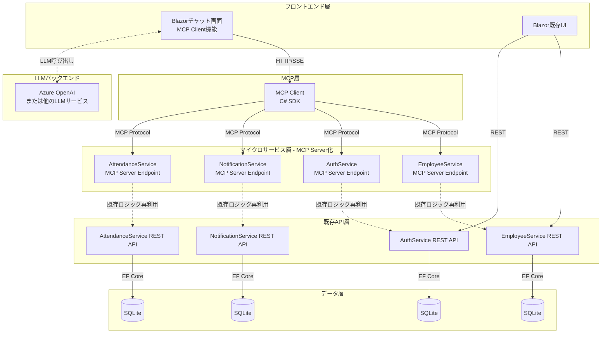

# MCP（Model Context Protocol）統合設計書

## ドキュメント概要

本ドキュメントは、従業員管理システムにMCP（Model Context Protocol）サーバーを統合し、Blazorベースのチャット画面をMCPクライアントとして実装するための包括的な設計指針を提供します。

**対象読者**: アーキテクト、開発者、システム設計者  
**作成日**: 2025-11-22  
**バージョン**: 1.0  
**ステータス**: 設計方針策定フェーズ

---

## 目次

1. [MCP概要](#1-mcp概要)
2. [統合アーキテクチャ](#2-統合アーキテクチャ)
3. [技術スタック・SDK](#3-技術スタックsdk)
4. [各サービスMCPサーバー実装方針](#4-各サービスmcpサーバー実装方針)
5. [チャット画面MCPクライアント実装方針](#5-チャット画面mcpクライアント実装方針)
6. [通信プロトコル・Transport](#6-通信プロトコルtransport)
7. [セキュリティ設計](#7-セキュリティ設計)
8. [実装ロードマップ](#8-実装ロードマップ)
9. [参考資料](#9-参考資料)

---

## 1. MCP概要

### 1.1 MCPとは

**Model Context Protocol (MCP)** は、AIアプリケーションと外部ツール・データソース間の統合を標準化するためのオープンプロトコルです。

**主要な特徴:**
- LLM（大規模言語モデル）と外部システム間の構造化されたAPI呼び出し
- ツール、リソース、プロンプトの標準的な公開方法
- クライアント・サーバーアーキテクチャ
- 複数のTransport方式のサポート（HTTP/SSE、StdIO、WebSocket）

### 1.2 MCPアーキテクチャの基本構成

```
┌─────────────────┐
│   MCP Host      │ ← AIツール、エディタ（例: GitHub Copilot）
│  (AI-powered)   │
└────────┬────────┘
         │
    ┌────▼────┐
    │  MCP    │ ← ホストが使用するクライアント
    │ Client  │
    └────┬────┘
         │
    ┌────▼────┐
    │  MCP    │ ← ビジネスロジック、データソースを公開
    │ Server  │
    └─────────┘
```

**本システムでの適用:**
- **MCP Host**: Blazor チャット画面（+ LLMバックエンド）
- **MCP Client**: Blazor内のMCPクライアント実装
- **MCP Server**: 各マイクロサービス（EmployeeService、AuthService、NotificationService）

### 1.3 MCPによる価値提供

**本システムでの期待効果:**

1. **自然言語によるサービス操作**
   - 「田中さんの情報を更新して」→ EmployeeService API呼び出し
   - 「通知一覧を表示」→ NotificationService API呼び出し

2. **統一的なAPI公開**
   - 各マイクロサービスの機能をMCPツールとして標準的に公開
   - LLMがサービス機能を発見・理解可能

3. **拡張性の向上**
   - 新しいサービスを追加してもMCP標準に従うだけで統合可能
   - クライアント側の変更を最小化

---

## 2. 統合アーキテクチャ

### 2.1 システム全体構成図



### 2.2 主要コンポーネント

#### 2.2.1 MCPクライアント（Blazorチャット画面）

- **役割**: ユーザーの自然言語入力をLLMに送信し、LLMからのMCPツール呼び出し要求を各サービスに転送
- **実装場所**: `src/WebApps/BlazorWeb/Components/Chat/`
- **使用SDK**: `ModelContextProtocol` NuGetパッケージ

#### 2.2.2 MCPサーバー（各マイクロサービス）

- **役割**: サービス機能をMCPツールとして公開
- **実装場所**: 各サービスの `API` プロジェクト内
- **使用SDK**: `ModelContextProtocol.AspNetCore` NuGetパッケージ

---

## 3. 技術スタック・SDK

### 3.1 公式MCP C# SDK

#### 3.1.1 主要パッケージ

| パッケージ名 | 用途 | バージョン |
|------------|------|-----------|
| `ModelContextProtocol` | MCPクライアント・サーバー基本機能 | 0.4.0-preview.3以降 |
| `ModelContextProtocol.AspNetCore` | ASP.NET Core統合（サーバー側） | 0.4.0-preview.3以降 |
| `ModelContextProtocol.Core` | 低レベルAPI | 0.4.0-preview.3以降 |

#### 3.1.2 対応フレームワーク

- **.NET 8.0**
- **.NET 10.0** （推奨）
- **.NET Standard 2.0+**

#### 3.1.3 公式リポジトリ・ドキュメント

- GitHub: [modelcontextprotocol/csharp-sdk](https://github.com/modelcontextprotocol/csharp-sdk)
- ドキュメント: [https://modelcontextprotocol.github.io/csharp-sdk/](https://modelcontextprotocol.github.io/csharp-sdk/)
- Microsoft Learn: [MCP入門ガイド](https://learn.microsoft.com/en-us/dotnet/ai/get-started-mcp)

### 3.2 本システムでの技術選定

#### 3.2.1 サーバーサイド

```xml
<!-- 各サービスAPI.csprojに追加 -->
<PackageReference Include="ModelContextProtocol.AspNetCore" Version="0.4.0-preview.3" />
```

**理由:**
- ASP.NET Coreとのシームレスな統合
- 依存性注入、ミドルウェア、ルーティングとの親和性
- HTTP/SSE transportの標準サポート

#### 3.2.2 クライアントサイド（Blazor）

```xml
<!-- BlazorWeb.csprojに追加 -->
<PackageReference Include="ModelContextProtocol" Version="0.4.0-preview.3" />
```

**理由:**
- Blazor Server/WebAssembly両対応
- SignalRとの統合可能（リアルタイム通信）
- 非同期処理のサポート

### 3.3 追加技術要素

#### 3.3.1 LLMバックエンド

**推奨オプション:**

1. **Azure OpenAI Service** （推奨）
   - 理由: Microsoftエコスystem、Entra ID認証、日本リージョン対応
   - SDK: `Azure.AI.OpenAI` NuGetパッケージ

2. **Semantic Kernel**
   - 理由: MCPプラグイン標準サポート、オーケストレーション機能
   - SDK: `Microsoft.SemanticKernel` NuGetパッケージ
   - MCP統合: [公式ガイド](https://learn.microsoft.com/en-us/semantic-kernel/concepts/plugins/adding-mcp-plugins)

3. **その他のLLMサービス**
   - OpenAI API
   - Google Gemini
   - Anthropic Claude

**実装パターン:**

```csharp
// Semantic Kernelを使用したMCPサーバー統合例
var kernel = Kernel.CreateBuilder()
    .AddAzureOpenAIChatCompletion(deploymentName, endpoint, apiKey)
    .Build();

// MCPサーバーをプラグインとして追加
await kernel.AddMcpPluginAsync(new McpPluginConfiguration
{
    ServerUrl = "https://localhost:5001/api/mcp/employee",
    Transport = McpTransport.HttpStream
});

var result = await kernel.InvokePromptAsync("田中太郎さんの情報を更新して");
```

#### 3.3.2 通信プロトコル

- **HTTP/SSE (Server-Sent Events)** - リモート通信用（推奨）
- **StdIO** - ローカル開発・テスト用
- **WebSocket/SignalR** - リアルタイム双方向通信用（オプション）

---

## 4. 各サービスMCPサーバー実装方針

### 4.1 共通実装パターン

#### 4.1.1 基本構成

各マイクロサービスは以下の構造でMCP機能を追加します：

```
Services/[ServiceName]/API/
├── Controllers/          # 既存REST API（維持）
├── Mcp/                 # 新規：MCP関連コード
│   ├── Tools/           # MCPツール定義
│   │   ├── [Entity]Tools.cs
│   │   └── [Feature]Tools.cs
│   └── Configuration/   # MCP設定
│       └── McpConfiguration.cs
└── Program.cs           # MCP登録コード追加
```

#### 4.1.2 Program.cs 統合パターン

```csharp
var builder = WebApplication.CreateBuilder(args);

// 既存サービス登録
builder.Services.AddControllers();
builder.Services.AddDbContext<ApplicationDbContext>();
// ... 既存の依存性注入 ...

// MCP Server 登録
builder.Services.AddMcpServer()
    .WithHttpTransport()                // HTTP/SSE transport有効化
    .WithToolsFromAssembly();           // 自動的に[McpServerToolType]クラスを検出

// CORS設定（MCP用）
builder.Services.AddCors(options =>
{
    options.AddPolicy("McpPolicy", policy =>
    {
        policy.AllowAnyOrigin()
              .AllowAnyHeader()
              .AllowAnyMethod();
    });
});

var app = builder.Build();

// 既存ミドルウェア
app.UseAuthentication();
app.UseAuthorization();

// MCP エンドポイントマッピング
app.MapMcp("/api/mcp");  // MCPエンドポイント: /api/mcp

// CORS有効化
app.UseCors("McpPolicy");

app.MapControllers();  // 既存REST API

app.Run();
```

**重要ポイント:**
- 既存のREST APIは**完全に維持**
- MCPは `/api/mcp` という専用エンドポイントで公開
- CORS設定はMCPクライアント（Blazor）からのアクセスに必要

#### 4.1.3 MCPツール定義パターン

```csharp
using ModelContextProtocol.Server;
using System.ComponentModel;

namespace EmployeeService.API.Mcp.Tools;

/// <summary>
/// 従業員管理に関するMCPツール
/// </summary>
[McpServerToolType]
public class EmployeeTools
{
    private readonly IEmployeeRepository _repository;
    private readonly ILogger<EmployeeTools> _logger;

    public EmployeeTools(IEmployeeRepository repository, ILogger<EmployeeTools> logger)
    {
        _repository = repository;
        _logger = logger;
    }

    /// <summary>
    /// 従業員情報を取得します
    /// </summary>
    /// <param name="employeeId">従業員ID</param>
    /// <returns>従業員情報</returns>
    [McpServerTool(Description = "指定された従業員IDの従業員情報を取得します")]
    public async Task<EmployeeDto> GetEmployeeAsync(
        [Description("従業員ID")] int employeeId)
    {
        _logger.LogInformation("MCP: Getting employee {EmployeeId}", employeeId);
        
        var employee = await _repository.GetByIdAsync(employeeId);
        if (employee == null)
        {
            throw new InvalidOperationException($"従業員ID {employeeId} が見つかりません");
        }
        
        return new EmployeeDto(
            employee.Id,
            employee.FirstName,
            employee.LastName,
            employee.Email,
            employee.Department
        );
    }

    /// <summary>
    /// 従業員一覧を取得します
    /// </summary>
    [McpServerTool(Description = "全従業員の一覧を取得します")]
    public async Task<IEnumerable<EmployeeDto>> ListEmployeesAsync()
    {
        _logger.LogInformation("MCP: Listing all employees");
        
        var employees = await _repository.GetAllAsync();
        return employees.Select(e => new EmployeeDto(
            e.Id,
            e.FirstName,
            e.LastName,
            e.Email,
            e.Department
        ));
    }

    /// <summary>
    /// 従業員情報を更新します
    /// </summary>
    [McpServerTool(Description = "既存の従業員情報を更新します")]
    public async Task<EmployeeDto> UpdateEmployeeAsync(
        [Description("従業員ID")] int employeeId,
        [Description("名前")] string? firstName = null,
        [Description("苗字")] string? lastName = null,
        [Description("メールアドレス")] string? email = null,
        [Description("部署")] string? department = null)
    {
        _logger.LogInformation("MCP: Updating employee {EmployeeId}", employeeId);
        
        var employee = await _repository.GetByIdAsync(employeeId);
        if (employee == null)
        {
            throw new InvalidOperationException($"従業員ID {employeeId} が見つかりません");
        }

        // 既存ドメインロジックを再利用
        if (firstName != null) employee.UpdateFirstName(firstName);
        if (lastName != null) employee.UpdateLastName(lastName);
        if (email != null) employee.UpdateEmail(email);
        if (department != null) employee.UpdateDepartment(department);
        
        await _repository.UpdateAsync(employee);
        
        return new EmployeeDto(
            employee.Id,
            employee.FirstName,
            employee.LastName,
            employee.Email,
            employee.Department
        );
    }
}
```

**設計原則:**
- `[McpServerToolType]`: クラスレベル属性でMCPツールクラスであることを宣言
- `[McpServerTool]`: メソッドレベル属性でMCPツールであることを宣言
- `[Description]`: ツール・パラメータの説明（LLMが理解するため重要）
- **既存ビジネスロジックの再利用**: Repository、Domainロジックを再利用
- **依存性注入対応**: コンストラクタインジェクション

### 4.2 EmployeeServiceのMCP化

#### 4.2.1 公開するツール

| ツール名 | 説明 | メソッド |
|---------|------|---------|
| `get_employee` | 従業員情報取得 | `GetEmployeeAsync(int id)` |
| `list_employees` | 従業員一覧取得 | `ListEmployeesAsync()` |
| `search_employees` | 従業員検索 | `SearchEmployeesAsync(string query)` |
| `create_employee` | 従業員登録 | `CreateEmployeeAsync(...)` |
| `update_employee` | 従業員情報更新 | `UpdateEmployeeAsync(...)` |
| `delete_employee` | 従業員削除 | `DeleteEmployeeAsync(int id)` |
| `get_employee_departments` | 部署一覧取得 | `GetDepartmentsAsync()` |

#### 4.2.2 実装ファイル構成

```
src/Services/EmployeeService/API/
├── Mcp/
│   └── Tools/
│       ├── EmployeeTools.cs        # 従業員CRUD操作
│       └── DepartmentTools.cs      # 部署関連操作
└── Program.cs
```

### 4.3 AuthServiceのMCP化

#### 4.3.1 公開するツール

| ツール名 | 説明 | メソッド |
|---------|------|---------|
| `get_current_user` | 現在のユーザー情報取得 | `GetCurrentUserAsync()` |
| `list_users` | ユーザー一覧取得（管理者のみ） | `ListUsersAsync()` |
| `get_user_roles` | ユーザーのロール取得 | `GetUserRolesAsync(string userId)` |
| `assign_role` | ロール割り当て（管理者のみ） | `AssignRoleAsync(...)` |

**セキュリティ注意:**
- パスワード変更などの機密操作はMCP経由で公開しない
- 認証トークン検証を必須とする
- ロールベースアクセス制御を実装

#### 4.3.2 実装ファイル構成

```
src/Services/AuthService/API/
├── Mcp/
│   └── Tools/
│       ├── UserTools.cs           # ユーザー情報操作
│       └── RoleTools.cs           # ロール管理操作
└── Program.cs
```

### 4.4 NotificationServiceのMCP化

#### 4.4.1 公開するツール

| ツール名 | 説明 | メソッド |
|---------|------|---------|
| `get_notifications` | 通知一覧取得 | `GetNotificationsAsync(string? userId)` |
| `get_unread_count` | 未読通知数取得 | `GetUnreadCountAsync(string userId)` |
| `mark_as_read` | 通知を既読にする | `MarkAsReadAsync(int notificationId)` |
| `delete_notification` | 通知削除 | `DeleteNotificationAsync(int notificationId)` |

#### 4.4.2 実装ファイル構成

```
src/Services/NotificationService/API/
├── Mcp/
│   └── Tools/
│       └── NotificationTools.cs   # 通知操作
└── Program.cs
```

### 4.5 AttendanceServiceのMCP化（将来対応）

#### 4.5.1 公開するツール

| ツール名 | 説明 | メソッド |
|---------|------|---------|
| `get_attendance` | 勤怠情報取得 | `GetAttendanceAsync(...)` |
| `clock_in` | 出勤記録 | `ClockInAsync(int employeeId)` |
| `clock_out` | 退勤記録 | `ClockOutAsync(int employeeId)` |
| `get_attendance_summary` | 勤怠サマリー取得 | `GetAttendanceSummaryAsync(...)` |

---

## 5. チャット画面MCPクライアント実装方針

### 5.1 Blazorコンポーネント構成

#### 5.1.1 ファイル構造

```
src/WebApps/BlazorWeb/
├── Components/
│   └── Chat/
│       ├── ChatPage.razor              # チャット画面メインページ
│       ├── ChatPage.razor.cs           # コードビハインド
│       ├── ChatMessageList.razor       # メッセージ一覧表示
│       ├── ChatInput.razor             # メッセージ入力欄
│       └── Services/
│           ├── IMcpChatService.cs      # MCPチャットサービスIF
│           ├── McpChatService.cs       # MCP統合実装
│           └── ChatMessage.cs          # メッセージDTO
├── wwwroot/
│   └── css/
│       └── chat.css                    # チャット画面スタイル
└── Program.cs                          # サービス登録
```

### 5.2 MCPクライアント実装

#### 5.2.1 サービス登録（Program.cs）

```csharp
// src/WebApps/BlazorWeb/Program.cs

builder.Services.AddScoped<IMcpChatService, McpChatService>();

// Azure OpenAI設定
builder.Services.AddAzureOpenAIChatCompletion(
    deploymentName: builder.Configuration["AzureOpenAI:DeploymentName"]!,
    endpoint: builder.Configuration["AzureOpenAI:Endpoint"]!,
    apiKey: builder.Configuration["AzureOpenAI:ApiKey"]!
);

// MCPクライアント設定
builder.Services.AddSingleton<IMcpClientFactory, McpClientFactory>();
```

#### 5.2.2 MCPチャットサービス実装

```csharp
// src/WebApps/BlazorWeb/Components/Chat/Services/McpChatService.cs

using ModelContextProtocol.Client;
using Microsoft.Extensions.AI;

namespace BlazorWeb.Components.Chat.Services;

public interface IMcpChatService
{
    Task<string> SendMessageAsync(string userMessage, CancellationToken cancellationToken = default);
    Task<IEnumerable<string>> GetAvailableToolsAsync(CancellationToken cancellationToken = default);
}

public class McpChatService : IMcpChatService
{
    private readonly IChatClient _chatClient;
    private readonly IMcpClientFactory _mcpClientFactory;
    private readonly ILogger<McpChatService> _logger;
    private readonly Dictionary<string, McpClient> _mcpClients = new();

    public McpChatService(
        IChatClient chatClient,
        IMcpClientFactory mcpClientFactory,
        ILogger<McpChatService> logger)
    {
        _chatClient = chatClient;
        _mcpClientFactory = mcpClientFactory;
        _logger = logger;
    }

    public async Task InitializeAsync()
    {
        // 各MCPサーバーに接続
        _mcpClients["employee"] = await _mcpClientFactory.CreateClientAsync(
            "https://localhost:5001/api/mcp");  // EmployeeService
        
        _mcpClients["notification"] = await _mcpClientFactory.CreateClientAsync(
            "https://localhost:5002/api/mcp");  // NotificationService
        
        _mcpClients["auth"] = await _mcpClientFactory.CreateClientAsync(
            "https://localhost:5003/api/mcp");  // AuthService
    }

    public async Task<string> SendMessageAsync(string userMessage, CancellationToken cancellationToken)
    {
        _logger.LogInformation("Processing user message: {Message}", userMessage);

        // 1. ユーザーメッセージをLLMに送信
        var chatHistory = new List<ChatMessage>
        {
            new SystemChatMessage("あなたは従業員管理システムのアシスタントです。ユーザーの要求に応じて、適切なツールを呼び出してください。"),
            new UserChatMessage(userMessage)
        };

        // 2. LLMが利用可能なツールを取得
        var availableTools = await GetAllMcpToolsAsync(cancellationToken);

        // 3. LLMにツール情報を含めてリクエスト
        var response = await _chatClient.CompleteAsync(
            chatHistory,
            new ChatOptions
            {
                Tools = availableTools
            },
            cancellationToken);

        // 4. LLMからのツール呼び出し要求を処理
        if (response.ToolCalls != null && response.ToolCalls.Any())
        {
            foreach (var toolCall in response.ToolCalls)
            {
                var toolResult = await ExecuteMcpToolAsync(toolCall, cancellationToken);
                chatHistory.Add(new ToolResultMessage(toolCall.ToolCallId, toolResult));
            }

            // 5. ツール実行結果を含めて再度LLMに問い合わせ
            response = await _chatClient.CompleteAsync(chatHistory, cancellationToken: cancellationToken);
        }

        return response.Message.Text ?? "応答がありませんでした。";
    }

    private async Task<IEnumerable<AITool>> GetAllMcpToolsAsync(CancellationToken cancellationToken)
    {
        var tools = new List<AITool>();

        foreach (var (serviceName, client) in _mcpClients)
        {
            try
            {
                var mcpTools = await client.ListToolsAsync(cancellationToken);
                
                // MCPツールをAITool形式に変換
                foreach (var mcpTool in mcpTools)
                {
                    tools.Add(new AITool
                    {
                        Name = $"{serviceName}_{mcpTool.Name}",
                        Description = mcpTool.Description,
                        // パラメータスキーマ変換
                        Parameters = ConvertMcpParametersToAIParameters(mcpTool.InputSchema)
                    });
                }
            }
            catch (Exception ex)
            {
                _logger.LogError(ex, "Failed to get tools from MCP server: {ServiceName}", serviceName);
            }
        }

        return tools;
    }

    private async Task<string> ExecuteMcpToolAsync(ToolCall toolCall, CancellationToken cancellationToken)
    {
        // ツール名から対応するMCPクライアントを特定
        // 例: "employee_get_employee" -> "employee"サービスの"get_employee"ツール
        var parts = toolCall.ToolName.Split('_', 2);
        if (parts.Length != 2 || !_mcpClients.TryGetValue(parts[0], out var client))
        {
            return $"Unknown tool: {toolCall.ToolName}";
        }

        var serviceName = parts[0];
        var actualToolName = parts[1];

        try
        {
            _logger.LogInformation("Executing MCP tool: {Service}.{Tool}", serviceName, actualToolName);

            // MCPツールを実行
            var result = await client.CallToolAsync(
                actualToolName,
                toolCall.Arguments,
                cancellationToken);

            return result.ToString() ?? "No result";
        }
        catch (Exception ex)
        {
            _logger.LogError(ex, "Failed to execute MCP tool: {Service}.{Tool}", serviceName, actualToolName);
            return $"エラーが発生しました: {ex.Message}";
        }
    }

    public async Task<IEnumerable<string>> GetAvailableToolsAsync(CancellationToken cancellationToken)
    {
        var toolNames = new List<string>();

        foreach (var (serviceName, client) in _mcpClients)
        {
            try
            {
                var tools = await client.ListToolsAsync(cancellationToken);
                toolNames.AddRange(tools.Select(t => $"{serviceName}.{t.Name}"));
            }
            catch (Exception ex)
            {
                _logger.LogError(ex, "Failed to list tools from {ServiceName}", serviceName);
            }
        }

        return toolNames;
    }

    private AIParameterMetadata ConvertMcpParametersToAIParameters(JsonNode? inputSchema)
    {
        // MCPのJSONスキーマをAITool形式のパラメータに変換
        // 実装詳細は省略
        return new AIParameterMetadata();
    }
}
```

### 5.3 チャット画面UI実装

#### 5.3.1 ChatPage.razor

```razor
@page "/chat"
@using BlazorWeb.Components.Chat.Services
@inject IMcpChatService ChatService
@inject ILogger<ChatPage> Logger

<PageTitle>AIチャット</PageTitle>

<div class="chat-container">
    <div class="chat-header">
        <h3>従業員管理システム AIアシスタント</h3>
        <p class="text-muted">自然言語で従業員情報の検索・更新ができます</p>
    </div>

    <div class="chat-messages" @ref="_messagesContainer">
        <ChatMessageList Messages="@_messages" />
    </div>

    <div class="chat-input">
        <ChatInput OnSendMessage="HandleSendMessageAsync" IsProcessing="@_isProcessing" />
    </div>
</div>

@code {
    private ElementReference _messagesContainer;
    private List<ChatMessage> _messages = new();
    private bool _isProcessing = false;

    protected override async Task OnInitializedAsync()
    {
        // ウェルカムメッセージ
        _messages.Add(new ChatMessage
        {
            Role = "assistant",
            Content = "こんにちは！従業員管理システムのAIアシスタントです。従業員情報の検索、更新、通知の確認などをお手伝いします。どのような操作をしますか？",
            Timestamp = DateTime.Now
        });
    }

    private async Task HandleSendMessageAsync(string userMessage)
    {
        if (string.IsNullOrWhiteSpace(userMessage) || _isProcessing)
            return;

        try
        {
            _isProcessing = true;

            // ユーザーメッセージを追加
            _messages.Add(new ChatMessage
            {
                Role = "user",
                Content = userMessage,
                Timestamp = DateTime.Now
            });
            StateHasChanged();

            // MCPサービスを通じてLLMに送信
            var response = await ChatService.SendMessageAsync(userMessage);

            // アシスタントの応答を追加
            _messages.Add(new ChatMessage
            {
                Role = "assistant",
                Content = response,
                Timestamp = DateTime.Now
            });
        }
        catch (Exception ex)
        {
            Logger.LogError(ex, "Error processing chat message");
            _messages.Add(new ChatMessage
            {
                Role = "assistant",
                Content = $"エラーが発生しました: {ex.Message}",
                Timestamp = DateTime.Now,
                IsError = true
            });
        }
        finally
        {
            _isProcessing = false;
            StateHasChanged();
        }
    }
}
```

#### 5.3.2 チャット例

**ユーザー入力例:**

```
「田中太郎さんの情報を教えて」
→ employee_get_employee ツール呼び出し → 結果表示

「営業部の全員を一覧表示して」
→ employee_search_employees(department: "営業部") 呼び出し → 結果表示

「未読通知を確認したい」
→ notification_get_notifications 呼び出し → 結果表示

「田中さんのメールアドレスを tanaka@example.com に変更して」
→ employee_update_employee(employeeId: xxx, email: "tanaka@example.com") 呼び出し
```

---

## 6. 通信プロトコル・Transport

### 6.1 Transport方式の選択

#### 6.1.1 HTTP/SSE（推奨）

**特徴:**
- サーバーからクライアントへの一方向ストリーミング
- 長時間接続に対応
- ファイアウォール・プロキシフレンドリー

**用途:**
- リモートMCPサーバーへのアクセス
- クラウドデプロイメント
- 本番環境

**実装例（サーバー側）:**
```csharp
builder.Services.AddMcpServer()
    .WithHttpTransport();  // HTTP/SSE transport

app.MapMcp("/api/mcp");
```

**実装例（クライアント側）:**
```csharp
var transport = new HttpClientTransport(new HttpClientTransportOptions
{
    BaseUrl = new Uri("https://localhost:5001/api/mcp")
});
var client = await McpClient.CreateAsync(transport);
```

#### 6.1.2 StdIO

**特徴:**
- 標準入出力を使用
- プロセス間通信

**用途:**
- ローカル開発
- デスクトップアプリケーション
- CLIツール統合

#### 6.1.3 WebSocket/SignalR（オプション）

**特徴:**
- 双方向リアルタイム通信
- Blazor Serverと親和性高い

**用途:**
- 通知のプッシュ配信
- リアルタイムチャット
- ライブデータ更新

**実装検討:**
```csharp
// Blazor ServerはSignalRを標準で使用
// MCPとSignalRの統合カスタムTransportを実装可能

public class SignalRMcpTransport : IMcpTransport
{
    private readonly HubConnection _hubConnection;

    public SignalRMcpTransport(HubConnection hubConnection)
    {
        _hubConnection = hubConnection;
    }

    // IMcpTransport実装
}
```

### 6.2 Transport選定基準

| 要件 | 推奨Transport | 理由 |
|------|-------------|------|
| 本番環境 | HTTP/SSE | 標準的、スケーラブル |
| 開発環境 | HTTP/SSE | 本番環境と同じ |
| ローカルテスト | StdIO | シンプル |
| リアルタイム通知 | SignalR | Blazor標準 |

---

## 7. セキュリティ設計

### 7.1 認証・認可

#### 7.1.1 基本方針

**原則:**
- **MCPエンドポイントも既存APIと同等のセキュリティレベルを維持**
- JWT トークンベース認証
- ロールベースアクセス制御（RBAC）

#### 7.1.2 認証フロー

```
1. ユーザー → Blazor: ログイン
2. Blazor → AuthService: 認証リクエスト
3. AuthService → Blazor: JWTトークン返却
4. Blazor → MCPクライアント: トークン設定
5. MCPクライアント → MCPサーバー: トークン付きMCPリクエスト
6. MCPサーバー: トークン検証 → 処理実行
```

#### 7.1.3 実装（サーバー側）

```csharp
// Program.cs

builder.Services.AddAuthentication(JwtBearerDefaults.AuthenticationScheme)
    .AddJwtBearer(options =>
    {
        options.TokenValidationParameters = new TokenValidationParameters
        {
            ValidateIssuer = true,
            ValidateAudience = true,
            ValidateLifetime = true,
            ValidateIssuerSigningKey = true,
            ValidIssuer = builder.Configuration["Jwt:Issuer"],
            ValidAudience = builder.Configuration["Jwt:Audience"],
            IssuerSigningKey = new SymmetricSecurityKey(
                Encoding.UTF8.GetBytes(builder.Configuration["Jwt:Key"]!))
        };
    });

builder.Services.AddAuthorization(options =>
{
    options.AddPolicy("EmployeeAccess", policy =>
        policy.RequireRole("Employee", "Manager", "Admin"));
    
    options.AddPolicy("AdminOnly", policy =>
        policy.RequireRole("Admin"));
});

var app = builder.Build();

app.UseAuthentication();
app.UseAuthorization();

// MCPエンドポイントに認証を適用
app.MapMcp("/api/mcp").RequireAuthorization("EmployeeAccess");
```

#### 7.1.4 実装（MCPツール側）

```csharp
[McpServerToolType]
public class EmployeeTools
{
    private readonly IHttpContextAccessor _httpContextAccessor;

    [McpServerTool(Description = "従業員を削除します（管理者のみ）")]
    public async Task DeleteEmployeeAsync(int employeeId)
    {
        // 現在のユーザーを取得
        var user = _httpContextAccessor.HttpContext?.User;
        
        // ロール確認
        if (user?.IsInRole("Admin") != true)
        {
            throw new UnauthorizedAccessException("この操作には管理者権限が必要です");
        }

        // 削除処理
        await _repository.DeleteAsync(employeeId);
    }
}
```

### 7.2 入力検証・サニタイゼーション

#### 7.2.1 基本方針

**LLMからの入力も信頼しない - Prompt Injection対策**

- すべてのパラメータを検証
- SQL Injection対策（EF Core使用で基本的に安全）
- XSS対策（Blazorの自動エスケープ + 明示的サニタイゼーション）

#### 7.2.2 実装例

```csharp
[McpServerTool]
public async Task<EmployeeDto> CreateEmployeeAsync(
    [Description("名前")] string firstName,
    [Description("苗字")] string lastName,
    [Description("メールアドレス")] string email)
{
    // 入力検証
    if (string.IsNullOrWhiteSpace(firstName) || firstName.Length > 50)
        throw new ArgumentException("名前は1～50文字で入力してください", nameof(firstName));

    if (string.IsNullOrWhiteSpace(lastName) || lastName.Length > 50)
        throw new ArgumentException("苗字は1～50文字で入力してください", nameof(lastName));

    if (!IsValidEmail(email))
        throw new ArgumentException("有効なメールアドレスを入力してください", nameof(email));

    // サニタイゼーション
    firstName = SanitizeInput(firstName);
    lastName = SanitizeInput(lastName);

    // 既存ビジネスロジックを使用（ドメインレベルでも検証）
    var employee = Employee.Create(firstName, lastName, email);
    await _repository.AddAsync(employee);

    return MapToDto(employee);
}

private string SanitizeInput(string input)
{
    // HTMLタグ除去、特殊文字エスケープなど
    return System.Net.WebUtility.HtmlEncode(input.Trim());
}

private bool IsValidEmail(string email)
{
    try
    {
        var addr = new System.Net.Mail.MailAddress(email);
        return addr.Address == email;
    }
    catch
    {
        return false;
    }
}
```

### 7.3 CORS設定

#### 7.3.1 本番環境

```csharp
builder.Services.AddCors(options =>
{
    options.AddPolicy("McpProductionPolicy", policy =>
    {
        policy.WithOrigins(
                "https://yourdomain.com",           // 本番Blazorアプリ
                "https://copilot.github.com"        // GitHub Copilot（オプション）
            )
            .AllowAnyHeader()
            .AllowAnyMethod()
            .AllowCredentials();  // 認証情報を含むリクエストを許可
    });
});

app.UseCors("McpProductionPolicy");
```

#### 7.3.2 開発環境

```csharp
if (app.Environment.IsDevelopment())
{
    builder.Services.AddCors(options =>
    {
        options.AddPolicy("McpDevelopmentPolicy", policy =>
        {
            policy.AllowAnyOrigin()
                  .AllowAnyHeader()
                  .AllowAnyMethod();
        });
    });
    
    app.UseCors("McpDevelopmentPolicy");
}
```

### 7.4 レート制限

#### 7.4.1 実装例（ASP.NET Core Rate Limiting）

```csharp
using Microsoft.AspNetCore.RateLimiting;
using System.Threading.RateLimiting;

builder.Services.AddRateLimiter(options =>
{
    options.AddFixedWindowLimiter("mcp", opt =>
    {
        opt.PermitLimit = 100;           // 100リクエスト
        opt.Window = TimeSpan.FromMinutes(1);  // 1分間
        opt.QueueProcessingOrder = QueueProcessingOrder.OldestFirst;
        opt.QueueLimit = 10;
    });
});

var app = builder.Build();

app.UseRateLimiter();

app.MapMcp("/api/mcp")
    .RequireAuthorization("EmployeeAccess")
    .RequireRateLimiting("mcp");
```

### 7.5 ログ・監視

#### 7.5.1 MCPツール呼び出しログ

```csharp
[McpServerTool]
public async Task<EmployeeDto> UpdateEmployeeAsync(int employeeId, ...)
{
    var user = _httpContextAccessor.HttpContext?.User;
    var userId = user?.FindFirst(ClaimTypes.NameIdentifier)?.Value;

    _logger.LogInformation(
        "MCP Tool Call: {ToolName} by User: {UserId}, EmployeeId: {EmployeeId}",
        nameof(UpdateEmployeeAsync),
        userId,
        employeeId);

    // 処理...
}
```

#### 7.5.2 OpenTelemetry統合

```csharp
// 既存のServiceDefaults経由でOpenTelemetry設定済み
// MCPツール呼び出しも自動的にトレースされる

builder.Services.AddOpenTelemetry()
    .WithTracing(tracing =>
    {
        tracing.AddSource("ModelContextProtocol");  // MCP SDK のトレース
        tracing.AddAspNetCoreInstrumentation();
    });
```

---

## 8. 実装ロードマップ

### 8.1 フェーズ1: 基礎実装（2週間）

#### Week 1: 環境構築・PoC

- [ ] NuGetパッケージ追加
  - `ModelContextProtocol.AspNetCore` → 各サービスAPI
  - `ModelContextProtocol` → BlazorWeb
  - `Azure.AI.OpenAI` または `Microsoft.SemanticKernel` → BlazorWeb
- [ ] EmployeeServiceに最小限のMCPサーバー実装
  - `get_employee` ツールのみ
  - `/api/mcp` エンドポイント公開
- [ ] Blazorに最小限のMCPクライアント実装
  - 基本的なチャット画面
  - EmployeeServiceへの接続
- [ ] 動作確認
  - ローカル環境での統合テスト
  - LLMを使った簡単な対話テスト

**成果物:**
- 動作するPoC（Proof of Concept）
- 技術的な課題の洗い出し

#### Week 2: 認証・セキュリティ基盤

- [ ] JWT認証の統合
  - MCPエンドポイントへの認証適用
  - Blazor → MCP間のトークン伝播
- [ ] 入力検証・サニタイゼーション実装
- [ ] CORS設定
- [ ] ログ・監視基盤
- [ ] セキュリティテスト

**成果物:**
- セキュアなMCP統合基盤
- セキュリティ設計ドキュメント更新

### 8.2 フェーズ2: 機能拡充（2週間）

#### Week 3: 全サービスMCP化

- [ ] EmployeeService全ツール実装
  - CRUD操作すべて
  - 検索機能
- [ ] AuthService MCP化
  - ユーザー情報取得
  - ロール管理（管理者機能）
- [ ] NotificationService MCP化
  - 通知一覧取得
  - 未読管理

**成果物:**
- 全サービスのMCPサーバー実装完了

#### Week 4: チャット機能強化

- [ ] チャット画面UI改善
  - メッセージ履歴表示
  - ローディングインジケーター
  - エラーハンドリング
- [ ] LLM統合の最適化
  - プロンプトエンジニアリング
  - ツール選択精度向上
- [ ] ユーザーフィードバック機能
  - 「この回答は役に立ちましたか？」
- [ ] チャット履歴の永続化（オプション）

**成果物:**
- 完全なチャット機能
- ユーザーテストフィードバック

### 8.3 フェーズ3: 本番化準備（1週間）

#### Week 5: 最適化・テスト

- [ ] パフォーマンステスト
  - 同時アクセステスト
  - レスポンスタイム測定
- [ ] レート制限の調整
- [ ] エラーハンドリングの強化
- [ ] ドキュメント整備
  - 運用マニュアル
  - トラブルシューティングガイド
- [ ] デプロイ手順書作成

**成果物:**
- 本番環境対応完了
- 運用ドキュメント一式

### 8.4 フェーズ4: 追加機能（継続的）

- [ ] AttendanceService MCP化
- [ ] 高度なクエリ機能
  - 複数サービス連携クエリ
  - 集計・レポート生成
- [ ] 音声入力対応（オプション）
- [ ] 多言語対応（オプション）

---

## 9. 参考資料

### 9.1 公式ドキュメント

#### MCP C# SDK

- **GitHub リポジトリ**: [modelcontextprotocol/csharp-sdk](https://github.com/modelcontextprotocol/csharp-sdk)
- **ドキュメント**: [MCP C# SDK Documentation](https://modelcontextprotocol.github.io/csharp-sdk/)
- **NuGet**: [ModelContextProtocol](https://www.nuget.org/packages/ModelContextProtocol)

#### Microsoft Learn

- [MCP入門ガイド](https://learn.microsoft.com/en-us/dotnet/ai/get-started-mcp)
- [最小MCPサーバーの作成](https://learn.microsoft.com/en-us/dotnet/ai/quickstarts/build-mcp-server)
- [最小MCPクライアントの作成](https://learn.microsoft.com/en-us/dotnet/ai/quickstarts/build-mcp-client)
- [Azure App ServiceでMCPサーバーを統合](https://learn.microsoft.com/en-us/azure/app-service/tutorial-ai-model-context-protocol-server-dotnet)

#### MCP プロトコル仕様

- [Model Context Protocol 公式サイト](https://modelcontextprotocol.io/)
- [MCP仕様書](https://spec.modelcontextprotocol.io/)

### 9.2 関連技術

#### Azure OpenAI / Semantic Kernel

- [Azure OpenAI Service](https://learn.microsoft.com/en-us/azure/ai-services/openai/)
- [Semantic Kernel](https://learn.microsoft.com/en-us/semantic-kernel/)
- [Semantic KernelでMCPプラグインを追加](https://learn.microsoft.com/en-us/semantic-kernel/concepts/plugins/adding-mcp-plugins)

#### Blazor / SignalR

- [Blazor SignalRガイダンス](https://learn.microsoft.com/en-us/aspnet/core/blazor/fundamentals/signalr)
- [BlazorでSignalRを使用](https://learn.microsoft.com/en-us/aspnet/core/blazor/tutorials/signalr-blazor)

### 9.3 サンプルコード

- [Microsoft MCP .NET サンプル](https://github.com/microsoft/mcp-dotnet-samples)
- [Azure MCP Server](https://github.com/Azure/azure-mcp)

### 9.4 ブログ記事

- [Microsoft partners with Anthropic to create official C# SDK for Model Context Protocol](https://devblogs.microsoft.com/blog/microsoft-partners-with-anthropic-to-create-official-c-sdk-for-model-context-protocol)
- [Build a Model Context Protocol (MCP) server in C#](https://devblogs.microsoft.com/dotnet/build-a-model-context-protocol-mcp-server-in-csharp/)
- [Build MCP Remote Servers with Azure Functions](https://devblogs.microsoft.com/dotnet/build-mcp-remote-servers-with-azure-functions/)

---

## 付録A: 用語集

| 用語 | 説明 |
|------|------|
| **MCP** | Model Context Protocol - LLMと外部システムを接続する標準プロトコル |
| **MCP Host** | MCPクライアントを使用してMCPサーバーと通信するAIアプリケーション |
| **MCP Client** | MCPサーバーに接続してツールを呼び出すクライアント実装 |
| **MCP Server** | ツール、リソース、プロンプトを公開するサーバー実装 |
| **MCPツール** | MCPサーバーが公開する実行可能な機能（関数） |
| **Transport** | MCPクライアント・サーバー間の通信方式（HTTP/SSE、StdIO等） |
| **SSE** | Server-Sent Events - サーバーからクライアントへの一方向ストリーミング |
| **StdIO** | Standard Input/Output - プロセス間通信方式 |

---

## 付録B: チェックリスト

### 設計レビューチェックリスト

- [ ] 各サービスのMCPツール定義は明確か
- [ ] 認証・認可の設計は適切か
- [ ] 入力検証・サニタイゼーションは十分か
- [ ] CORS設定は環境ごとに適切か
- [ ] エラーハンドリングは網羅的か
- [ ] ログ・監視戦略は明確か
- [ ] パフォーマンス要件を満たせるか
- [ ] 既存APIとの互換性は保たれているか

### 実装前チェックリスト

- [ ] .NET 10 SDK インストール済み
- [ ] NuGetパッケージの互換性確認
- [ ] Azure OpenAI または他のLLMサービスのアカウント準備
- [ ] 開発環境でのAspire動作確認
- [ ] セキュリティポリシーの確認
- [ ] チーム内での設計レビュー完了

### 実装後チェックリスト

- [ ] すべてのMCPツールが正しく動作する
- [ ] 認証が適切に機能する
- [ ] エラーが適切にハンドリングされる
- [ ] ログが正しく出力される
- [ ] パフォーマンステスト通過
- [ ] セキュリティテスト通過
- [ ] ドキュメント更新完了

---

**ドキュメント管理情報**

- **最終更新日**: 2025-11-22
- **作成者**: GitHub Copilot (.NET Expert Agent)
- **レビュー状態**: 初版（レビュー待ち）
- **次回レビュー予定**: フェーズ1完了時

---

本設計書は、次のフェーズで具体的な実装タスクに分割するための基礎資料として作成されました。実装時には本ドキュメントをベースに、詳細な技術仕様書・実装ガイドを作成してください。
